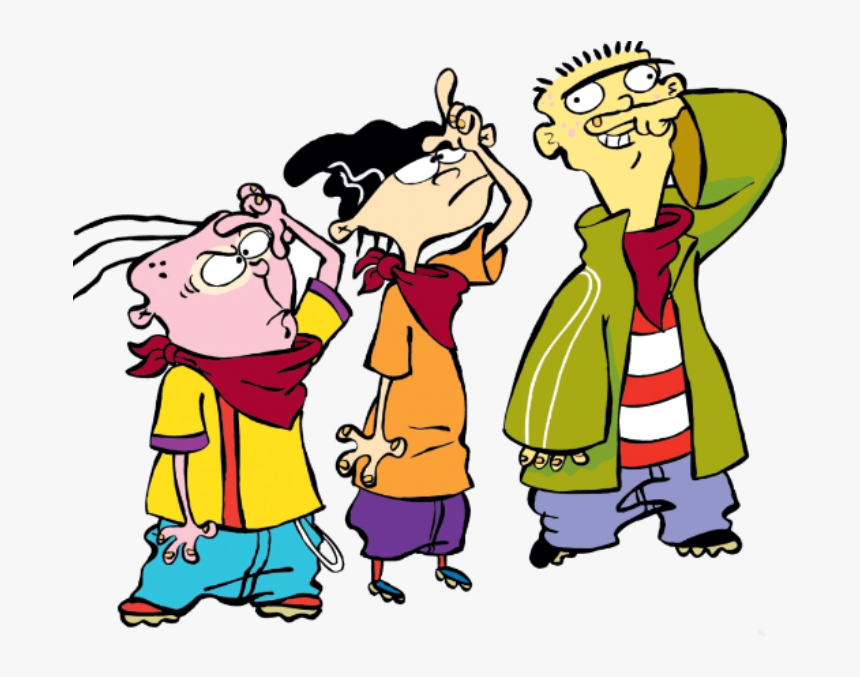
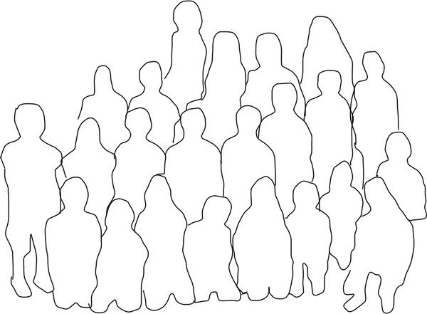
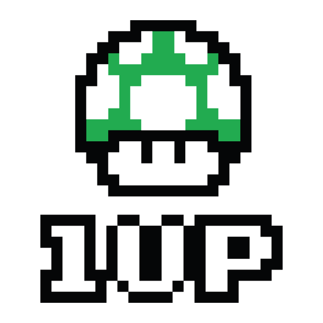
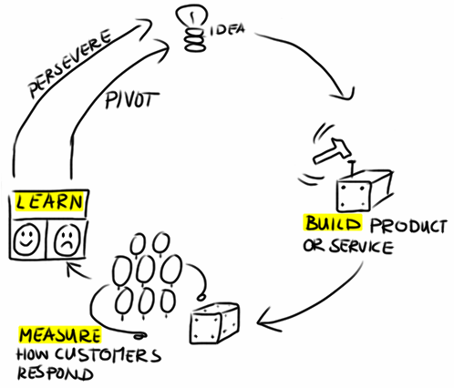
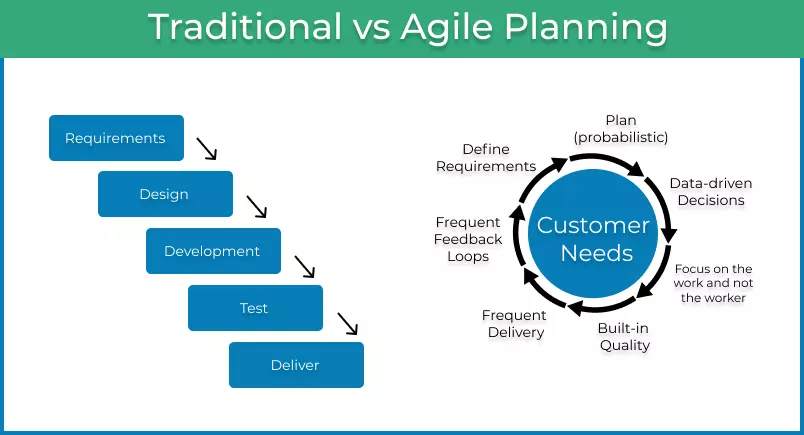
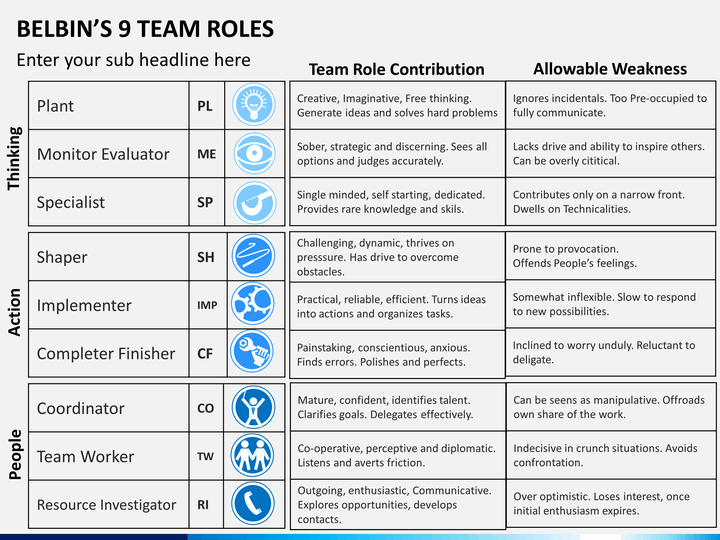

```{r setup, include=FALSE}
knitr::opts_chunk$set(echo = FALSE)
```


## What to expect from this course

```{r, out.width="60%", fig.align="center", echo = FALSE}
knitr::include_graphics("../../figures/running.jpg")
```

 - Introduce some basic data science skills
 - Demonstrate how to work effectively in cross-disciplinary teams
 - Give an opportunity to learn and produce something worklife related

## Who are we?

Solveig Bjørkholt (PhD in political science)

Sondre Elstad (PhD in economics)

Alex Moltzau (AI Policy and Ethics at NORA)

```{r, out.width="60%", fig.align="center", echo = FALSE}

```


## Who are you? :)

 - What's your name?
 - What do you study?
 - Have you used any R before?
 - What would you like to get out of this course?

```{r, out.width="60%", fig.align="center", echo = FALSE}

```

## What is a hackathon?

 - Hacking: Problem solving
 - An event where people come together for a set duration of time to solve problems.
 
Kind of like a festival!

<br>

```{r, out.width="60%", fig.align="center", echo = FALSE}
knitr::include_graphics("../../figures/hackathon.jpg")
```


## What is "political data science"?

**Political science**: Domain knowledge about power relations, institutions and broad analytical skills for studying social phenomena.

```{r, out.width="60%", fig.align="center", echo = FALSE}
knitr::include_graphics("../../figures/datascience_figure.png")
```

## Course material

 - [Main course material](https://pages.github.uio.no/solvebjo/Political_Data_Science_Hackathon_2022/index.html)
 - R for Data Science
 - Storytelling with data
 - Text mining with R
 - Machine Learning for Social Scientists
 
But consider these *learning resources* rather than syllabus. The goal here is to learn through creating, so use these resources to look up things you wonder about rather than read them from A to Z.

## Course overview

 - Week 1: Team work, Github, R, RStudio and R Markdown. Presentations from stakeholders.
 - Week 2: Data gathering and visualization.
 - Week 3: Text analysis.
 
 - Week 4: Machine learning.
 - Week 5: Machine learning, iterative work, deployment and IT communication.
 
 - Week 6: Finishing projects and final presentations.


## The "final exam"

1. An R Markdown report exploring the case (optionally including a dashboard)
2. A Github repository with reproducible code
3. A team presentation at the **4th of August** for the stakeholders and others

```{r, out.width="30%", fig.align="center", echo = FALSE}

```
<br>

 - The course ends with a pass/fail grade.
 - And a reward for the winner team.
 

## The **one-up awards**

 - We are a very diverse group in terms of backgrounds, programming competencies and so forth
 - To capitalize on that, we need to help each other out
 
The **one-up awards**: Two awards to the two students who make a particular effort to help others out. 

```{r, out.width="40%", fig.align="center", echo = FALSE}

```

## Location location{data-background="../../figures/locations.png" data-background-size=cover}

<div class="black">

<br>
<br>
<br>

Monday 27. June to Wednesday 13. July (week 1, 2 and 3)

<br>
<br>
<br>

Monday 18. July to Thursday 4. August (week 4, 5, and 6)

</div>

## Cases and stakeholders{.smaller}

Case descriptions can be found in [Canvas](https://uio.instructure.com/courses/39604/modules).

 - **SSB**: How can we contribute to better official statistics using webscraping to create an indicator of statistical quality from the "About the statistics" part on www.ssb.no?
 
 - **NORAD**: How can we use classification algorithms to discover whether an aid agreement also contributes to reduction of greenhouse gas emissions?

 - **UNA (FN-sambandet)**: How can we use the *storingscrape* API to explore the political effect of UNA?

 - **OAG (Riksrevisjonen)**: How can we use various data sources on health statistics to map the efficiency and quality of the Norwegian health care system?

 - **OPX**: How can we use various data sources on NGOs to create a product that maps the most efficient and robust NGOs for investors?


## Group 1: Statistics Norway{.smaller}

|      | Group 1 - SSB                                    |                                               |                              |          |
|------|--------------------------------------------------|-----------------------------------------------|------------------------------|----------|
| 1    | Abdullah Mohamed Reda Almudaffar                 | Faculty of Mathematics and   Natural Sciences | Robotics (Informatics)       | Bachelor |
| 2    | Beate Solstrand Baklund                          | Faculty of Social Sciences                    | Political Science            | Bachelor |
| 3    | Tyra Larsdatter Grasmo                           | Faculty of Social Sciences                    | Sociology                    | Bachelor |
| 4    | Vera Erikstad Rutherfurd                         | Faculty of Mathematics and   Natural Sciences | Mathematics with Informatics | Bachelor |
| 5    | Nora Christina Lokken                            | Faculty of Social Sciences                    | Master of Economics (2-year) | Master   |
| Case | SSB: Webscraping, structuring, automated program |                                               |                              |          |

## Group 2: NORAD{.smaller}

|      | Group 2 - NORAD                                       |                                               |                                                 |          |
|------|-------------------------------------------------------|-----------------------------------------------|-------------------------------------------------|----------|
| 1    | Eira Henden Nybakk                                    | Faculty of Social Sciences                    | Political Science                               | Bachelor |
| 2    | Nora Didriksen                                        | Faculty of Social Sciences                    | Political Science                               | Bachelor |
| 3    | Nikolai Elias Koop                                    | Faculty of Mathematics and   Natural Sciences | Informatics: Digital Economics   and leadership | Bachelor |
| 4    | Oda Strand Marchand                                   | Faculty of Humanities                         | European languages - Russian   language         | Bachelor |
| 5    | Kasim Sadikovic                                       | Faculty of Mathematics and   Natural Sciences | Mathematics                                     | Bachelor |
| Case | Norad: Data collection, text analysis, classification |                                               |                                                 |          |

## Group 3: FN-sambandet{.smaller}
**The United Nations Association of Norway**

|      | Group 3 - FN-sambandet              |                            |                                                            |          |
|------|-------------------------------------|----------------------------|------------------------------------------------------------|----------|
| 1    | Markus Annæus Austreim Opheim       | Faculty of Social Sciences | Samfunnsøkonomi (bachelor)                                 | Bachelor |
| 2    | Hannes Bräuer                       | Faculty of Social Sciences | Peace and Conflict Studies                                 | Master   |
| 3    | Andreas Lind Kroknes                | Faculty of Social Sciences | Master program Political   Science/Statsvitenskap - Master | Master   |
| 4    | Gard Olav Dietrichson               | Faculty of Social Sciences | Political Science                                          | Master   |
| 5    | Jørn Lager Lyngås                   | Faculty of Social Sciences | Sosialantropologi                                          | Bachelor |
| Case | FN-sambandet: API, data structuring |                            |                                                            |          |

## Group 4: Riksrevisjonen{.smaller}
**The Office of the Auditor General of Norway **

|      | Group 4 - Riksrevisjonen                              |                            |                                              |          |
|------|-------------------------------------------------------|----------------------------|----------------------------------------------|----------|
| 1    | Xhensila Kllogjeri                                    | Faculty of Social Sciences | Samfunnsøkonomi                              | Bachelor |
| 2    | Christine Diane Malaca Morte                          | Faculty of Law             | Master i rettsvitenskap                      | Master   |
| 3    | Izolda Vlasova                                        | Faculty of Social Sciences | Samfunnsøkonomi                              | Bachelor |
| 4    | Anton Kristian Bugge                                  | Faculty of Social Sciences | Political Science                            | Bachelor |
| 5    | Hedvig Signy Monsen Kristoffersen                     | Faculty of Social Sciences | Master in Economic Theory and   Econometrics | Master   |
| 6    | Willem Ofstad                                         | Faculty of Social Sciences | Master of Economic Theory and   Econometrics | Master   |
| Case | Riksrevisjonen: Data collection, exploratory analysis |                            |                                              |          |

## Group 5: Oslo Philanthropic Exchange (OPX){.smaller}

|      | Group 5 - OPX                               |                            |                                               |          |
|------|---------------------------------------------|----------------------------|-----------------------------------------------|----------|
| 1    | Agnieszka Sadlowska                         | Faculty of Social Sciences | Statsvitenskap                                | Bachelor |
| 2    | Torbjørn Skinnemoen Ottersen                | Faculty of Social Sciences | Public administration and   leadership        | Bachelor |
| 3    | Ida Kristine Garthe                         | Faculty of Humanities      | Chinese Culture and Society                   | Master   |
| 4    | Henrik Waage Rui                            | Faculty of Social Sciences | Political Science                             | Bachelor |
| 5    | Amalie Halle Christensen                    | Faculty of Social Sciences | Masters in Economic Theory and   Econometrics | Master   |
| Case | OPX: Data collection and indicator building |                            |                                               |          |


## The stakeholder presentations

**On Friday the 1st of July**

|     Organization                                                  |     Presenter                |     Time             |     Group    |
|-------------------------------------------------------------------|------------------------------|----------------------|--------------|
|     Statistics Norway (SSB)                                       |     Xeni Kristine Dimakos    |     10:15 - 10:35    |     1        |
|     United Nations Association of Norway (FN-sambandet)           |     Nicholas Wilkinson       |     10:40 - 11:00    |     3        |
|     Norad                                                         |     Einar Tornes             |     11:05 - 11:25    |     2        |
|     Office of   the Auditor General of Norway (Riksrevisjonen)    |     Aleksander Eilertsen     |     11:30 - 11:50    |     4        |
|     OPX (Oslo Philanthropic Exchange)                             |     Bosse Langaas            |     11:55 - 12:15    |     5        |


## Agile working methods

The *agile manifesto*:

 - Individuals and interactions over processes and tools
 - Working software over comprehensive documentation
 - Customer collaboration over contract negotiation
 - Responding to change over following a plan

```{r, out.width="40%", fig.align="center", echo = FALSE}

```

## Agile working methods

 - **Minimum viable product** (MVP): The least finished product you can make that will still allow you to test the functionality.

 - **Sprints**: Short sessions of work (e.g. one week) with clearly defined tasks
  
 - **Stakeholders**: Frequently talk to the people who are going to use your product -- does it address their needs?
 
 - **Roles**:
    - Product owner: Knows what the product should look like in the end
    - Team: Developers of the product
    - Scrum master: Facilitates the work

## Agile working methods

```{r, out.width="100%", fig.align="center", echo = FALSE}

```
 

## The Belbin Strength Test

How to capitalize on each others' strengths?

```{r}
video_files  <- "https://www.youtube.com/embed/Miiy2OYbap0"
```

<iframe width="200" src="`r video_files[1]`" align="middle" frameborder="0" allowfullscreen></iframe>


## The Belbin Strength Test

Find the test in Canvas.

```{r, out.width="70%", fig.align="center", echo = FALSE}

```

## Questions?

```{r, out.width="70%", fig.align="center", echo = FALSE}

```