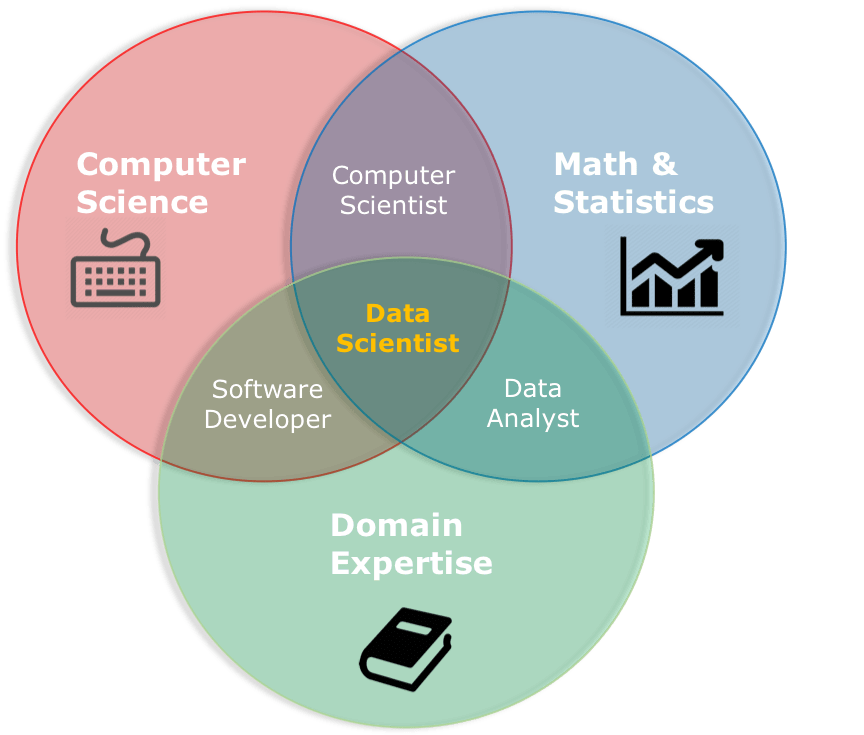

```{r setup, include=FALSE}
knitr::opts_chunk$set(echo = TRUE, error = FALSE, warning = FALSE, message=FALSE)
knitr::opts_chunk$set(tidy.opts=list(width.cutoff=80), tidy=TRUE)
```

## What is a hackathon?

Hackathons are a bit like festivals. People come together in an intense and focused setting to have a shared experience. One of the main differences, I would say, is that in a hackathon you also work together in a team to create something. By definition, hackathons are events in which "a large number of people meet to engage in collaborative computer programming." Usually, the end goal is to produce something, like a game, a software, or an API.

Hackathons are great because they allow us to be reminded of a few important facts: (1) Team-work is awesome when it works, (2) We can create great things in short time if we work with focus and (3) One of the best ways to learn is learning by doing.

Oh, and failing is a part of the process.

Naturally, we do not expect you to sit tight six weeks in a row and work with iron focus on your tasks throughout the summer months. However, we hope that you will take some of the ideas behind hackathons to heart. This is a playground just as much as it is a course. Learning, creating and producing is supposed to be challenging, rewarding, frustrating and - especially - fun! We hope this course will allow you to experience just that.


## How does this course work?

This course runs over six weeks. You will produce a report (or an app, if you like), that is related to a problem statement. The problem statements are provided by actors from work life. You work in teams with people from different disciplinary backgrounds. In the end, you present your final product to the rest of us and the work life actors, and one team wins the hackathon. They receive a price! Otherwise, the course is pass/fail. 

Most days we provide some tasks to work on in the second half of the lecture, but there are no hand-ins except for the final report. The lectures run from 10:00 to 12:00, and are organized so that the first hour is theory, while the second hour is focused on practice. 

Please note: *In the third week, we have a long weekend (14.-17. June) and from week 4, we change location from Blindern to Statistics Norway (Akersveien 26).*

That was a little bit about the structure. Now, about the content. Throughout the course, we have three goals in mind:

1.  Introduce and teach some basic data science skills.
2.  Demonstrate how to work effectively in cross-disciplinary teams.
3.  Give an opportunity to learn and produce something worklife related.

This course will not cover everything data science related. In fact, it will only give you a glimpse into the world of data science. However, hopefully it will give you the knowledge you need to pursue more knowledge. You see, data science is a highly cross-disciplinary field, and we need people with different competences. To illustrate, look at the figure below. Many would agree that data science is some sort of cross-over between computer science, statistics and domain expertise. Often, this means building high-end knowledge in one of the circles, and knowing enough about the other circles to be able to work in team-based contexts to draw on each other's specialties. Being able to understand, translate and work cross-disciplinary is an incredibly useful skill.


```{r, out.width="70%", fig.align="center", echo = FALSE}

```

So, what do we mean by the different points above? Well, in short:

**1. Introduce and teach some basic data science skills.**

-   Using R (functions, visualization, paths)
-   Collaborating using Github
-   Finding data (working with databases, APIs and webpages)
-   Programming with text
-   Machine learning (supervised and unsupervised)

**2. Demonstrate how to work effectively in cross-disciplinary teams.**

-   Working under agile principles.
-   Using know-how from team-based work.

**3. Give an opportunity to learn and produce something work life related.**

-   Work on a problem statement provided by work life organizations.
-   Get some examples on how data science can be used in work life contexts.


Here is a table that details more specifically what we will cover in each week:


| Week | Date   | Day       | Location | Time        | Topic                                                   |
|------|--------|-----------|----------|-------------|---------------------------------------------------------|
| 1    | 27.jun | Monday    | Blindern | 10:15-12:15 | Introduction to course                                  |
| 1    | 28.jun | Tuesday   | Blindern | 10:15-12:15 | R, RStudio, Workflow & Github                           |
| 1    | 29.jun | Wednesday | Blindern | 10:15-12:15 | Introduction to data analysis and   data transformation |
| 1    | 30.jun | Thursday  | Blindern | 10:15-12:15 | Descriptive statistics and relational data              |
| 1    | 01.jul | Friday    | Blindern | 10:15-12:15 | Case presentations                                      |
| 2    | 04.jul | Monday    | Blindern | 10:15-12:15 | Data sources & SQL                                      |
| 2    | 05.jul | Tuesday   | Blindern | 10:15-12:15 | Webscraping                                             |
| 2    | 06.jul | Wednesday | Blindern | 10:15-12:15 | API                                                     |
| 2    | 07.jul | Thursday  | Blindern | 10:15-12:15 | Data visualisation with ggplot                          |
| 2    | 08.jul | Friday    | Blindern | 10:15-12:15 | Data visualisation with plotly and dashbboards          |
| 3    | 11.jul | Monday    | Blindern | 10:15-12:15 | Text manipulation and text preprocessing                |
| 3    | 12.jul | Tuesday   | Blindern | 10:15-12:15 | Text tokenization and text vectorization                |
| 3    | 13.jul | Wednesday | Blindern | 10:15-12:15 | Text modelling                                          |
| 4    | 18.jul | Monday    | SSB      | 10:15-12:00 | Machine learning introduction                           |
| 4    | 19.jul | Tuesday   | SSB      | 10:15-12:00 | Models                                                  |
| 4    | 20.jul | Wednesday | SSB      | 10:15-12:00 | Supervised learning: Regression                         |
| 4    | 21.jul | Thursday  | SSB      | 10:15-12:00 | Supervised learning:   Classification                   |
| 4    | 22.jul | Friday    | SSB      | 10:15-12:00 | Loss functions                                          |
| 5    | 25.jul | Monday    | SSB      | 10:15-12:00 | Unsupervised learning                                   |
| 5    | 26.jul | Tuesday   | SSB      | 10:15-12:00 | Text and machine learning                               |
| 5    | 27.jul | Wednesday | SSB      | 10:15-12:00 | Iterative work                                          |
| 5    | 28.jul | Thursday  | SSB      | 10:15-12:00 | Deployment                                              |
| 5    | 29.jul | Friday    | SSB      | 10:15-12:00 | IT knowledge                                            |
| 6    | 01.aug | Monday    | SSB      | 10:15-12:00 | Team work                                               |
| 6    | 02.aug | Tuesday   | SSB      | 10:15-12:00 | Team work                                               |
| 6    | 03.aug | Wednesday | SSB      | 10:15-12:00 | Team work                                               |
| 6    | 04.aug | Thursday  | SSB      | 10:15-16:00 | Final presentations                                     |


### Requirements

**Laptop**: We do not have access to lab rooms, so you will need to bring your own laptop.

**Attendance**: We would like you to show up to every session. Formally, you must attend a minimum of 75% of the lectures in order to take the final exam (i.e. participate in the presentations in the end and get a pass/fail assessment). 

**Team work**: We hope and expect that you work together with your team members on the problem statement. You can decide yourselves how you would like to work, but we recommend meeting physically at least two times a week for a session of 2-4 hours. This makes it easier to track progress and it often makes working more rewarding. It is also useful to set up a Teams, Slack or other communication channels. Keep in mind that you may be on different levels with regard to programming skills, and you may come from very different backgrounds. Try to utilize this rather than view it as a hindrance. We reward teams that work to make each other better - both in terms of programming skills and other skills.

In short, for this to feel like an exciting but safe learning space, we need fun competitiveness and warm cooperativeness :)
