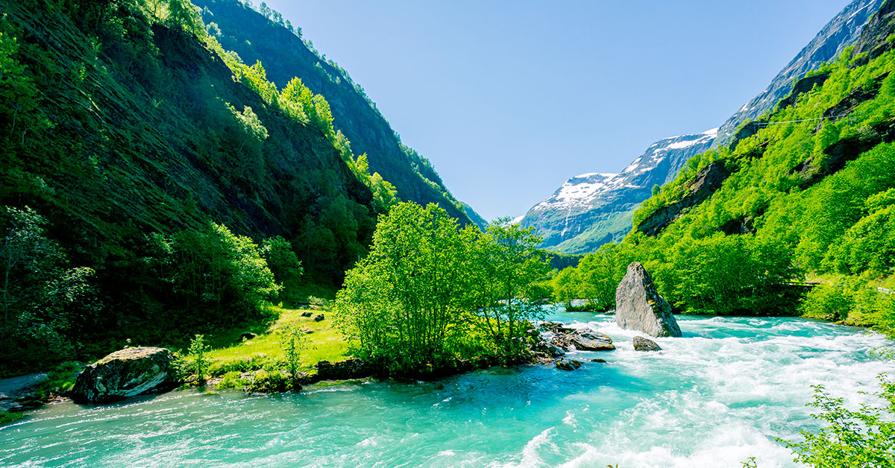

```{r setup, include=FALSE}
knitr::opts_chunk$set(echo = TRUE)
```

# Aurlandsdalen

My travel goal is Aurlandsdalen. It's on the west coast of Norway, a beautiful valley with rivers, waterfalls and mountains. I was there once some years ago, and it was wonderful. Unfortunately, we didn't walk the whole valley back then. It's about 57 km, and you can walk from cabin to cabin. 

**Price: about 5000 kroner**

# Lemonade sales

```{r}
prices <- c(30, 40, 10, 20)
```

```{r}
30*3+40*1+10*4+20*0

prices[1]*3+prices[2]*1+prices[3]*4+prices[4]*0
```

```{r}
sum(prices)
```

```{r}
names <- c("Fruity stuff", "Exotic mango", "Cheap crap", "Minty greens")
```

```{r, warning=FALSE, error=FALSE, message=FALSE}
library(tidyverse)
```

```{r}
lemonades <- tibble(prices, names)
```

```{r}
lemonades
# My favorite lemonade is on row 2
```

```{r}
# Checking the independent vectors:
class(prices)
class(names)

# Checking the variables in the dataset:
class(lemonades$prices)
class(lemonades$names)

# prices is numeric and names is character. Since the dataset contains two variables of different types, we could not have made it into a matrix. Matrices require all variables to be of the same type.

```

```{r}
customers <- c(49, 21, 59, 44)
```


```{r}
lemonades <- lemonades %>%
  mutate(customers = customers)
```


```{r}
sum(lemonades$prices*lemonades$customers)
```

*One more stand should do it.*


```{r, out.width = "80%", fig.align = "center"}

```

