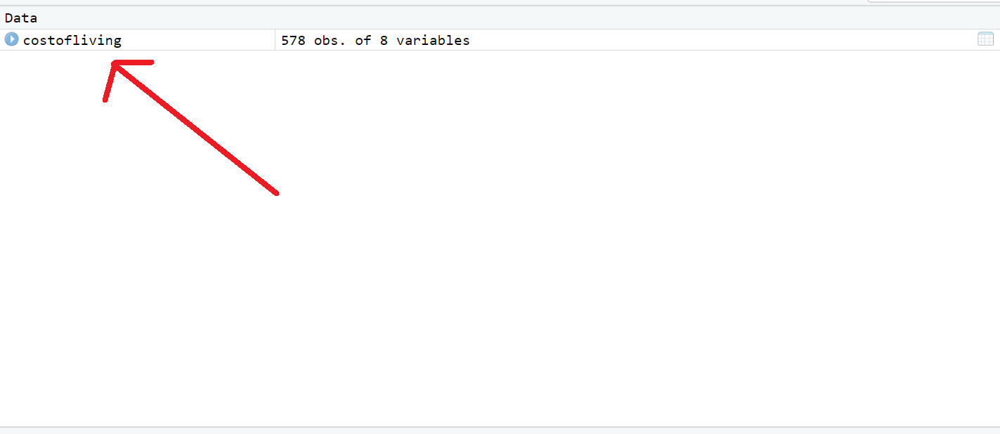

```{r setup, include=FALSE}
knitr::opts_chunk$set(echo = TRUE, error = FALSE, warning = FALSE, message=FALSE)
```


# Plan for today

## What we will learn today:

- Data import
- Understanding the dataframe
- Tidyverse functions
  - select
  - filter
  - rename
  - mutate
  - group_by and summarise
  - separate and unite


# What does data analysis entail?

Data analysis is all about using data to explore and test assumptions, trying to find patterns that can lead us to answers. Within political science, we tend to distinguish between two major modes of methodological approach:

 - Qualitative
 - Quantitative
 
Qualitative approaches rely on case studies, document analysis and interviews. They often have few cases (for example one or two countries) and study these in detail. Being able to go in depth on specific cases, these methods have some significant advantages. However, since they are limited in scope (few cases), it is hard to say something about whether what we find is transferable to other cases. Imagine you study whether people tend to vote equally to their parents. You could interview a few people and get some detailed information on the hows and whys, but you wouldn't know whether the findings reach more generally. Using quantitative techniques, however, you could study thousands of people at the same time and see if the finding is large and consistent enough to be a general pattern. 

There are three main ways of conducting quantitative analyses:

 - Descriptive
 - Causal
 - Predictive
 
Descriptive analysis is all about finding sums, averages, variation and distributions in data. It involves descriptive statistics, but also visualization. Roughly, the first three weeks in this course will be dedicated to descriptive analysis. 

Predictive analysis is all about trying to say something about how something works or might develop given data we do not have. As the name implies, it can often entail trying to say something about the future using data from previous years. We'll look at this during our last two weeks of machine learning. 

In this course, we'll not touch upon causal analysis. These methods use data to figure out whether A leads to B -- i.e. whether something is a *cause* of something else.

How these different categories link together will hopefully become clearer during the next weeks. We'll be working a lot with `R`, so it's useful to focus on the general work flow of work in `R` regardless of whether we're doing descriptive, causal or predictive analysis. This work flow is shown in the figure below.

```{r, out.width="100%", echo = FALSE, fig.show="hold"}
knitr::include_graphics("../../figures/data-science-explore.png")
```

# Data import

The first stage of the work is to import data to R. We will look more at some ways of gathering data from the databases, the web or API in week 2, but for now, let's look at how to import regular data stored in `.csv`, `.RData`, `.rda` or `.rds`. 

First, recall that we store things in objects when working in R. So give your data a name, add an arrow `<-`, and then write a function to read in the data. The function you need depends on the format the data is stored in.

 - data**.csv** : `read_csv`
 - data**.rds** : `read_rds`
 - data**.RData** : `load`
 - data**.rda** : `load`

End with the folder path and the name of the dataset in quotation marks, `""`. 

Here, we'll work with the dataset `costofliving`, a dataset that tracks the cost of living by cities in 2022, gathered from [this website](https://www.kaggle.com/datasets/kkhandekar/cost-of-living-index-by-city-2022). On the website, the dataset is stored in `.csv`. I show here what the code would be if the data was stored in `.rds`, `rda` and `.RData`. 

The functions are from the `tidyverse` package. Therefore, load this package in using `library`. I also transform the dataset to a `tibble`, which is the name of the type of dataframe used in the `tidyverse`.

```{r}

library(tidyverse)

costofliving <- read_csv("../../datafolder/costofliving.csv")

costofliving <- read_rds("../../datafolder/costofliving.rds")

load("../../datafolder/costofliving.RData")

load("../../datafolder/costofliving.rda")

costofliving <- as_tibble(costofliving)

```


# The dataframe

So what does the data look like when we're doing quantitative analysis? Usually, we want the dataset to be in a *dataframe*. A dataframe has three components:

1. Rows: Observations
2. Columns: Variables
3. Cells: Values

The observations are the entities we have in our dataset, for example countries, people, time period, or likewise. Variables are the properties of our entities, for example size or type. The values are the mix between these -- the specific property that this specific entity has. 

```{r, echo = FALSE, out.width="80%"}
knitr::include_graphics("../../figures/dataset_example.png")
```

To see what our dataset looks like, you can click on the name of the dataset in the upper right corner of RStudio. 

```{r, echo = FALSE, out.width="80%"}

```

This dataset looks like below. The `City` variable denotes the observation -- the city and the corresponding country. The other variables denote properties of these cities, `cost of living`, `rent index` and so on. There is also a column named `Rank` containing `NA`, which means *missing*. 

```{r, echo = FALSE, out.width="50%"}
knitr::include_graphics("../../figures/dataset.png")
```

Another way of getting a look of the data in R is to use the function `glimpse`.

```{r}
glimpse(costofliving)
```


# `tidyverse` functions

After having imported the data into `R`, there is usually a bit of tidying that has to be done. We are going to learn how to do this through the `tidyverse` package. This package is fundamental to many operations in `R`. One of the main components of the `tidyverse` package is the `%>%`, also known as the pipe. The pipe allows us to access an object and apply functions to it in sequence. For example, if the object is `me`, the first function could be to `wake_up()`, then to the me that has woken up, `shower()`, and then to the me who has woken up and taken a shower, to `drink_coffee()`. This would look like below:

```{r, eval = FALSE}

me %>%
  wake_up() %>%
  shower() %>%
  drink_coffee()

```

We'll go through some of the main functions in the `tidyverse` package. However, first, it can be useful to change the names of the variables to something that does not have space, as it eases the work with the variables. To do this, load the package `janitor` and use the function `clean_names`. Here, we apply the pipe to the function, which basically means; go into the object `costofliving` and use the function `clean_names` on it.

```{r}

costofliving

library(janitor)

costofliving <- costofliving %>%
  clean_names()

costofliving

```

## `select`

The function `select` picks out some variables from the dataset.

```{r, eval = FALSE}
dataset %>%
  select(variable)
```

Recall that the dataset had 8 variables; `rank`, `city`, `cost_of_living_index`, `rent_index`, `cost_of_living_plus_rent_index`, `groceries_index`, `restaurant_price_index` and `local_purchasing_power_index`. If we only want a dataset with the two variables `cost_of_living_index` and `groceries_index`, we can use the `select` function.

```{r}

costofliving %>%
  select(cost_of_living_index, groceries_index) # Picking only these two variables

```
It can also be used to remove variables that we do not want in the dataset. If we want to remove more than one variable, we have to add a `c` and wrap the variables in parantheses. 

```{r}

costofliving %>%
  select(-cost_of_living_index)

costofliving %>%
  select(-c(cost_of_living_index, groceries_index))

```


## `filter`

The function `filter` picks out some observations from the dataset.

```{r, eval = FALSE}
dataset %>%
  filter(variable_name == value)
```

Curious about which cities that have a cost of living below 100 (meaning that they are cheaper than New York)? Ask for all units that score *less than* `<` 100 on the `cost_of_living_index`. 

```{r}
costofliving %>%
  filter(cost_of_living_index < 100)
```

Or if you want all the cities with equal `=` or higher than `>` 100 on the `cost_of_living_index`, use the code below.

```{r}
costofliving %>%
  filter(cost_of_living_index >= 100)
```

Want to know about only Oslo? Then filter out the row on the `city` variable that has the value `Oslo, Norway` (in quotation marks `""`). Notice that we use two equals signs `==`. This is to not confuse `R` into thinking that city equals Oslo, Norway.

```{r}
costofliving %>%
  filter(city == "Oslo, Norway")
```
Want more cities at the same time? Shift `==` with `%in%` and wrap the units into parantheses with a `c` in front. Also, remember the quotation marks `""`.

```{r}
costofliving %>%
  filter(city %in% c("Oslo, Norway",
                     "Bergen, Norway",
                     "Trondheim, Norway"))
```

## ``rename``

Would you like to change the name of a variable? Use `rename`. First, write the new name of the variable, then the name of the old variable. 

```{r, eval = FALSE}
dataset %>%
  rename(new_variable_name = old_variable_name)
```

In this case, I change the name an abbreviation of the variable name, so that `cost_of_living_index` becomes `cofi`. 

```{r}
costofliving <- costofliving %>%
  rename(cofi = cost_of_living_index)

costofliving
```

## ``separate`` and ``unite``

Separate and unite allows us to split or collect two variables based on a separator.

```{r, eval = FALSE}
dataset %>%
  separate(variable_name, into = c("new_variable_name1", "new_variable_name2"), sep = "separator")

dataset %>%
  unite(new_variable_name, c("old_variable_name1", "old_variable_name2"), sep = "separator") 
```

A useful thing to do here would be to separate the `city` variable into `city` and `country`. The separator in this case is a comma `,`, but it could also have been for example a dot, a space or a word such as "and". 

```{r}
costofliving <- costofliving %>%
  separate(city, into = c("city", "country"), sep = ",")

costofliving
```

## ``mutate``

If you would like to make a new variable, `mutate` is your go-to. First, write the name of the new variable, then add an equals sign `=`, and put the operation that you need to create your new variable. 

```{r, eval = FALSE}
dataset %>%
  mutate(variable_name = operation())
```

For example, if we want a new variable with the restaurant purchasing power as a share of the local purchasing power, we can make a new variable where we divide the first by the second.

```{r}
costofliving %>%
  mutate(share_restaurant_purchasing_power = restaurant_price_index/local_purchasing_power_index)
```

### `ifelse` 

If you want to make a variable that takes the value 1 when the country is Norway, match it with `ifelse`. The `ifelse` function works like this:

If `condiction`, then give the new variable the given value, if not, give it the other value. In this case, if the variable `country` has value "Norway", give the new variable `norway` value `1`, else give the new variable value `0`. 

```{r}
costofliving %>%
  mutate(norway = ifelse(country == "Norway", 1, 0))
```

You can also overwrite new variables with the function `mutate`. For example, if you aren't happy with the fact that the `country` variable is a "character", you can change it by using the function `as_factor` together with `mutate`. Notice in the function below that the name of the new variable is the same as the name of the old variable, `country`, thus we overwrite the old one.

```{r}
class(costofliving$country)

costofliving <- costofliving %>%
  mutate(country = as_factor(country))

class(costofliving$country)
```

## ``group_by`` and ``summarise``

At last, we can use the `summarise` function to make summaries of the dataset. This function works very well together with the function `group_by`. 

```{r, eval = FALSE}
dataset %>%
  group_by(variable) %>%
  summarise(new_variable_name = function(variable_name))
```

While `summarise` gives us aggregates of the data, the `group_by` specifies which units the aggregates should be by. For example, if we ask for the `sum` of the cost of living in general in the dataset, we could just use `summarise` directly.

```{r}
costofliving %>%
  summarise(cofi = sum(cofi))
```

A more useful distinction is, however, to look at the cost of living for each country. Then, we `group_by` country first, and then use `summarise` and `sum`. When using `group_by`, remember to `ungroup` afterwards.

```{r}
costofliving %>%
  group_by(country) %>%
  summarise(cofi = sum(cofi)) %>%
  ungroup()
```

Summarise also works with other descriptive functions such as:

 - `min` : Minimum value
 - `max` : Maximum value
 - `median` : Median
 - `mean` : Mean (average)
 - `sd` : Standard deviation

So, for example, to find the average cost of living in lagre cities in the respective countries, use `group_by`, `summarise` and `mean`. 

```{r}
costofliving %>%
  group_by(country) %>%
  summarise(cofi = mean(cofi)) %>%
  ungroup()
```

## Piping together

As you saw in the part above, pipes can be put in sequence. This is one of the great advantages of using pipes. Lots of code can be executed in a single "storyline" that says "first do this, then do this, then do this", and so on. Thus `tidyverse` is usually seen as a pedagogical tool because it's supposedly quite inuitive, and the code also becomes very readable. Consider the code below and decide for yourself whether you find it readable.

```{r}

costofliving %>%
  select(city, country, rent_index, restaurant_price_index, groceries_index) %>%
  filter(country %in% c(" Norway", " Germany", " Spain")) %>%
  mutate(total_cost_index = rent_index + restaurant_price_index + groceries_index) %>%
  group_by(country) %>%
  mutate(max_cost = max(total_cost_index)) %>%
  ungroup() %>%
  mutate(highest_city = ifelse(total_cost_index == max_cost, 1, 0)) %>%
  group_by(highest_city) %>%
  summarise(average_rent = mean(rent_index))

```

## Dealing with `NA`

What are those `NA` things that occur in some cells in the dataset? They are called "missing values". Missing values occur when there are values in the dataset that should ideally have been there, but they're not. This could for example be because we didn't find data on that particular thing, somebody refused to give us the information we needed, or because we've done something wrong in the code, generating `NA`.

To see how much missing there is in our dataset, we can use the function `is.na` along with the function `table`. `is.na` gives the value `TRUE` if the cell has a missing value and `FALSE` otherwise, while the function `table` counts the instances in which `TRUE` and `FALSE` occurs. This means, in other words, that we have 212 missing values in our data.

```{r}
costofliving %>%
  is.na() %>%
  table()
```

Want to remove all rows that have one or more missing values? Use the function `na.omit`.

```{r}
costofliving %>%
  na.omit()
```

If you would like to more carefully select which variables you'd like to remove the missing values from, use `drop_na` and choose the variables where the rows with missing values should be removed. 

```{r}
costofliving %>%
  drop_na(country, city, cofi)
```

## Saving the dataset

When you've loaded a dataset into `R` and tidied it up a bit, you might want to save it until next time. Which format you choose depends partly on your own preferences, and party what you'd like to do further with the dataset. If you want to send it to someone else, a `.csv` is probably best. If not, I recommend `.rds` because it allows you to give a name to the object when you read it into `R`. But some people prefer `.rda` and `.RData`, and it's nice to vary a bit to see what you like best.

```{r, eval = FALSE}
write_csv(costofliving, file = "../../datafolder/costofliving2.csv") # To save a .csv file

saveRDS(costofliving, file = "../../datafolder/costofliving2.rds") # To save a .rds file

save(costofliving, file = "../../datafolder/costofliving2.rda") # To save a .rda file

save(costofliving, file = "../../datafolder/costofliving2.RData") # To save a .RData file
```


------------------------------------------------------------------------------------------------------------------------------------------------------------------------------

# About the dataset

These indices are relative to New York City (NYC). Which means that for New York City, each index should be 100(%). If another city has, for example, rent index of 120, it means that on an average in that city rents are 20% more expensive than in New York City. If a city has rent index of 70, that means on average rent in that city is 30% less expensive than in New York City.

Cost of Living Index (Excl. Rent) is a relative indicator of consumer goods prices, including groceries, restaurants, transportation and utilities. Cost of Living Index does not include accommodation expenses such as rent or mortgage. If a city has a Cost of Living Index of 120, it means Numbeo has estimated it is 20% more expensive than New York (excluding rent).

Rent Index is an estimation of prices of renting apartments in the city compared to New York City. If Rent index is 80, Numbeo has estimated that price of rents in that city is on average 20% less than the price in New York.

Groceries Index is an estimation of grocery prices in the city compared to New York City. To calculate this section, Numbeo uses weights of items in the "Markets" section for each city.

Restaurants Index is a comparison of prices of meals and drinks in restaurants and bars compared to NYC.

Cost of Living Plus Rent Index is an estimation of consumer goods prices including rent comparing to New York City.

Local Purchasing Power shows relative purchasing power in buying goods and services in a given city for the average net salary in that city. If domestic purchasing power is 40, this means that the inhabitants of that city with an average salary can afford to buy on an average 60% less goods and services than New York City residents with an average salary.


