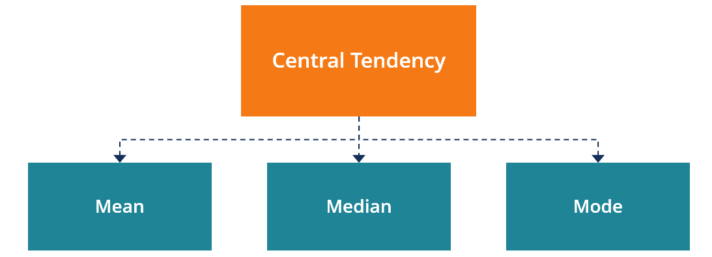
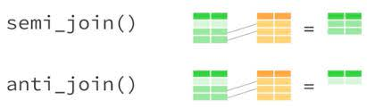

```{r setup, include=FALSE}
knitr::opts_chunk$set(echo = TRUE)
library(tidyverse)
```

# Plan for today

## What we will learn today:

- Find descriptive statistics
- Displaying descriptive statistics
- Joining datasets


# Find descriptive statistics

Descriptive statistics are useful in giving insights about patterns in your data. We are not going to delve heavily into statistics in this course, but we'll look at a few basic measures, including finding the:

 - `mean`
 - `median`
 - `mode`
 - `variance`
 - `standard deviation`
 - `count`
 
of a variable.

Let's read the dataset from yesterday in to `R`.

```{r}
costofliving <- read_rds("../../datafolder/costofliving2.rds")
```

## Measures to find central tendency

First, we'll look at measures to find central tendency. These measures reflect the center of a data distribution. What is a distribution, you might ask. Well, it's simply how our data looks with regard to how many different units have different values. For example, say our variable is how many minutes a person spends in the shower. If most people in the datset spends about 10 minutes, while a bit few spend equally 5 minutes and 15 minutes, we'd get a symmetrical distribution. However, if relatively more people spend 15 minutes, we'll get a negative skew, which means that the distribution would lean right. This is important because how the data is distributed is fundamental to a lot of techniques and models we use. 

```{r, out.width="100%", echo = FALSE, fig.show="hold"}
knitr::include_graphics("../../figures/distributions.png")
```

We'll look more into plotting in week 2. For now, I visualize the distribution of the `cofi` variable by making a histogram. Looks most cities here have a cost of living around 70. There's a slight negative skew to the data, meaning that most cities (thankfully) have a cost of living lower to that of New York. 

```{r}
costofliving %>%
  ggplot(aes(cofi)) + 
  geom_histogram() + 
  ggtitle("Distibution of cost of living")
```

Measures of central tendency, then, tells us where most of the units fall. There are three main ways of measuring central tendency:

 - **Mean**: the sum of the values divided by the number of values.
 - **Median**: the value that's exactly in the middle of the data when it is ordered.
 - **Mode**: the number which appears most often.

```{r, out.width="70%", echo = FALSE, fig.show="hold"}

```

Notice from the figure above that if the distribution is skewed, the mean, the median and the mode will differ. We'll find the mean, median and mode of our variable `cofi`. First, we load the `tidyverse` package. 

```{r}
library(tidyverse)
```

Then, finding the mean, we can use `summarise` together with the `mean` function. Notie that we add `na.rm = TRUE`, which means that `R` should calculate the mean without taking into account that there are missing values in the data. If there are missing values and we do not set `na.rm` to `TRUE`, the mean would become `NA`.

```{r}
costofliving %>%
  summarise(cofi_mean = mean(cofi, na.rm = TRUE)) # Use summarise and mean on the variable, set na.rm to TRUE
```

The average cost of living in all the cities in our dataset is 57.44.

To calculate the median, use the same procedure with `summarise`, but use the function `median`. Remember to add `na.rm = TRUE` to this piece of code as well.

```{r}
costofliving %>%
  summarise(cofi_median = median(cofi, na.rm = TRUE)) # Use summarise and median on the variable, set na.rm to TRUE
```

The median is slightly higher than the mean, which makes sense since our data has a negative skew.

Lastly, the mode is the value that occurs most frequently in our data. It can be a good measure if you have a count variable (i.e. a variable where you for example have counted the number of times a person goes to the cinema), but in cases where you have continuous data with decimals, it's usually not that useful to see which value that is most frequent. Thus, here, we calculate the mode on the `country` variable to see which country appears most often. 

```{r}
costofliving %>%
  count(country, name = "number_of_countries") %>% # Count the number of times each country shows up, giving the count variable the name number_of_countries
  slice_max(number_of_countries, n = 1) # Picking out the first maximum value of the number_of_countries variable
```

## Measures to find spread

Now that we know where most of the units fall on the distribution, it would also be useful to know something about the units that are not "typical" for the data. This is often referred to as the *spread* of the data, because it tells us something about all the units that fall around the central tendency.

Two measures are typically used:
  
 - **Variance**: How much a variable varies around the mean.
 - **Standard deviation**: How far on average each value lies from the mean.
 
To calculate the variance, use `var`. Admittedly, the *variance* measure does not tell us much except that there is variation around the mean in our data. 

```{r}
costofliving %>%
  summarise(cofi_variance = var(cofi, na.rm = TRUE)) # A positive number tells us that there is variation in our data
```

To say something more substantive about the spread, we can use the *standard deviation*. To calculate this, use the `sd` function. This is a measure that occurs in the same scale as the variable, so the standard deviation is the average units around the mean. 

```{r}
costofliving %>%
  summarise(cofi_sd = sd(cofi, na.rm = TRUE)) # Units vary on average 21.63 cost of living index points around the mean of 57.44.
```

## Count

If we have a categorical variable, it does not make sense to find either the mean, median, variance or standard deviation because there are no numerical values to calculate these statistics from. In these cases, we often just count the number of times different values occur.

We already had a look at this with calculating the mode. Here, I use somewhat of the same procedure by using `group_by` and `count`. I leave out the `slice_max` function which grabs only parts of the rows, and use instead `arrange` and `desc` to get the variable in descending order.

```{r}

costofliving %>%
  group_by(country) %>% # Find the next statistic per country
  count(name = "country_n") %>% # Count the number of instances (i.e. the number of countries per city)
  arrange(desc(country_n)) # Arrange in descending order so that the highest values come on top

```

Alternatively, we could find the percentages. Here, I find how many cities in the dataset each country in percentage stand for. Almost 8 percent of the cities in our dataset are in India.

```{r}

all_countries <- costofliving %>%
  count(name = "all_countries") %>% 
  pull() # Fetch the value from the dataset, creating a vector

costofliving %>%
  group_by(country) %>% 
  count(name = "country_n") %>% 
  ungroup() %>%
  mutate(country_percentage = country_n/all_countries * 100) %>% # Make a new variable calculating the percentage, i.e. the count divided by the total multiplied by 100
  arrange(desc(country_percentage)) 

```


# Displaying descriptive statistics

Sometimes, we might want to display several statistical measures at the same time. We can display the mean and the standard deviation together using `summarise`. 

```{r}
costofliving %>%
  summarise(cofi_mean = mean(cofi, na.rm = TRUE),
            cofi_sd = sd(cofi, na.rm = TRUE))
```

And we can combine several `tidyverse` functions such as `filter`, `select`, `group_by`, `summarise` and `rename` to get a table showing some central tendencies and variation on variables and units that are important for our analysis.

```{r}

cofi_table <- costofliving %>%
  filter(country %in% c(" United Kingdom", " Bulgaria", " Brazil", " Japan", " India")) %>% # Picking out these countries
  select(country, cofi) %>% # Fetching only the variables select and cofi
  na.omit() %>% # Removing missing variables from the data
  group_by(country) %>% # Finding the next summary statistics per country
  summarise(cofi_mean = mean(cofi, na.rm = TRUE), # Finding the mean of cost of living (per country)
            cofi_sd = sd(cofi, na.rm = TRUE)) %>% # Finding the standard deviation of cost of living (per country)
  rename("Country" = country, # Renaming the variables into something more human readable
         "Average cost of living" = cofi_mean,
         "Spread around cost of living" = cofi_sd)

cofi_table
```

If we would like to include this table in a `pdf` or `html` report, we can use the `knitr` package and the `kableExtra` package to wrap the table into a neat table-structure. The base functions in these packages is `kable` to make a pdf- or html-table, and `kable_styling` to make it a bit more beautiful. Here, I add the argument `latex_options = "HOLD_position"` because it stops the table from jumping around in the final pdf file.

```{r}

library(knitr)
library(kableExtra)

cofi_table %>%
  kable() %>% # Make html or pdf table
  kable_styling(latex_options = "HOLD_position") # Start styling the table

```

There are many ways to style your table so that it becomes the way you want it to, for example as shown in the code below. If you want to learn more, have a look at [this page](https://cran.r-project.org/web/packages/kableExtra/vignettes/awesome_table_in_html.html). Here, I also round the variable to two decimals before I make a beautiful table out of them, using `mutate` and `round`. 

```{r}
cofi_table %>%
  mutate(`Average cost of living` = round(`Average cost of living`, 2), # Rounding the variable into two decimals
         `Spread around cost of living` = round(`Spread around cost of living`, 2)) %>%
  kable() %>%
  kable_classic(full_width = FALSE, # Make the table fill the page with theme "classic"
                html_font = "Cambria", # Give a certain font to the page
                font_size = 12, # Set font size to 12
                latex_options = "HOLD_position") %>% # Keep the table in this spot when making the pdf file
  row_spec(0, color = "blue") %>% # Make the text in the top row blue
  column_spec(1, bold = TRUE, # Set the first column to bold
              border_right = TRUE) # Add a vertical line at the first column

```


# Joining datasets

It is seldom the case that all the data we need exists in one dataset from the beginning. Usually, we have to put together several datasets to get all the variables we want in *one* dataset. This process is called *joining* dataset (also known as *merging*). We'll learn about `left_join`, `right_join`, `inner_join` and `full_join` to join datasets. However, joining datasets can be quite tricky. Sometimes, the codes might not run and it can be difficult to understand why, and sometimes, the code might run and the result becomes utterly wrong. We need to have a good overview of what exactly the two datasets show. Therefore, before we do the joining, we'll have a look at the necessary steps first.

## Which variables do you need?

We'll join the `costofliving` dataset with a dataset on welfare institutions. You can find the dataset [here](https://www.lisdatacenter.org/news-and-events/comparative-welfare-states-dataset-2020/) and the codebook [here](https://www.lisdatacenter.org/wp-content/uploads/CWS-codebook-2020.pdf). Because the dataset has 400 variables to begin with, it's a good idea to use the codebook to check which variables you might need and `select` these into a smaller dataset.

 - **id**: The country variable in three letters (e.g. Norway becomes NOR)
 - **year**: The relevant year of the observation
 - **mgini**: Measure of income inequality before taxes and redistribution^[Market (Pre-Tax-and-Transfer) GINI Coefficient. Household income, whole population.].
 - **ngini**: Measure of income inequality after taxes and redistribution^[Net (Post-Tax-and-Transfer) GINI Coefficient Household income, whole population.]
 - **rred**: Relative redistribution^[Relative Redistribution; market-income inequality minus net-income inequality, divided by market-income inequality. Household income, whole population.]
 - **lowpay**: Incidence of low pay^[Defined as the percentage of workers earning less than two thirds of the median wage].

The dataset is in `.xlsx` format. To read in this type of data, we can load the package `readxl` and use the function `read_excel`. Then we can use `select` to fetch the variables we want and make a smaller dataset (often called a *subset*).

```{r}
library(readxl)

welfare <- read_excel("../../datafolder/CWS-data-2020.xlsx")

welfare_subset <- welfare %>%
  select(id, year, mgini, ngini, rred, lowpay)
```

## What will be the units in your final dataset?

### Aggregation level

When we join datasets, what we want to to **add variables to the units we already have**. So, in this case, we would like to add variables on redistribution to the cost of living in different cities. But there's a problem. Even though *city* is our smallest units in the `costofliving` dataset, it is not present in the `welfare_subset` dataset. Here, the smallest units are countries.

```{r}
glimpse(costofliving)
glimpse(welfare_subset)
```

Since we cannot break the country variable in the `welfare_subset` dataset down to cities (because we simply do not know which part of the variables belong to which cities), we have to go the other way and aggregate the variables in the `costofliving` dataset up to country level. We can do this through `summarise` and `mean`, as shown below. I use `mean` instead of `sum` because it doesn't make that much sense to add up index values. Now, we find the average cost of living in each country compared to New York, based on their biggest cities. 

```{r}

costofliving_agg <- costofliving %>%
  group_by(country) %>% # Find the following statistic per country
  summarise(cofi = mean(cofi, na.rm = TRUE), # The average cost of living based on the biggest cities in that country
            rent_index = mean(rent_index, na.rm = TRUE),
            groceries_index = mean(groceries_index, na.rm = TRUE),
            restaurant_price_index = mean(restaurant_price_index, na.rm = TRUE),
            local_purchasing_power_index = mean(local_purchasing_power_index, na.rm = TRUE))

```

Alternatively, if you want to be a bit more advanced and do it with less code, you can use `summarise_at` and make a function. 

```{r}
costofliving %>%
  group_by(country) %>%
  summarise_at(vars("cofi", "rent_index", "groceries_index", "restaurant_price_index", "local_purchasing_power_index"), 
               function(x){mean(x, na.rm = TRUE)}) # This function is equivalent to the one above, but with less lines of code
```

### Time aspect

Another thing to consider is the time aspect. Our `welfare_subset` data has data from 1960 to 2018. Our `costofliving` dataset has only data from 2022. In theory, we cannot really merge the datasets then, because we do not know the cost of living in any of the years of the welfare data, and vice versa. However, doing a rough approximation, we can pick a late year in the `welfare_subset` dataset with sufficiently complete values and assume that the variables do not change enough from year to year, so that within a ten-year period, it should correspond more or less. 

```{r}

welfare_subset <- welfare_subset %>%
  filter(year == 2015) %>% # Filtering out the value on year that is 2015
  select(-year) # Removing the variable year since it now only has one value, 2015

```


## Do the units have the same name?

The next thing to tackle is the so-called *key* of the datasets. The *key* is the variable or variables in the two datasets that are the same. Often, it is for example an id of a person, a country name and/or a time period such as a date or a year. In our case, there's only one shared key between the datasets -- country.

```{r, out.width="100%", echo = FALSE, fig.show="hold"}
knitr::include_graphics("../../figures/joins.png")
```

The *key* needs to have the same values. Here, we bump into another issue. The variables indicating the countries in the `welfare_subset` and the `costofliving` datasets struggle with two problems to be a shared key: (1) the variables are called different things (id in `welfare_subset` and country in `costofliving`), and (2) they have different labels for the same values (e.g. Australia is AUS in `welfare_subset` but Australia in `costofliving`).

To change this, we could use `case_when` together with `mutate` and recode every value. 

```{r}

welfare_subset %>%
  mutate(country = case_when( # Make a new variable called country
    id == "AUS" ~ "Australia", # When the variable id is "AUS", give the country variable value "Australia"
    id == "BEL" ~ "Belgium",
    id == "CAN" ~ "Canada"
  ))

```

This is a bit time consuming, so we'll use a shortcut here through the `countrycode` package. This package gives a standardized framework to recode country variables into new values (as you might understand, different values on country variables has been a pain for many joining problems).

```{r}

library(countrycode)

welfare_subset <- welfare_subset %>%
  mutate(country = countrycode(sourcevar = id, # Use the id variable to find the country name
                                 origin = "iso3c", # The inital variable has three letters for countries, also called the iso3c standard
                                 destination = "country.name")) # Recode these into full country names (in English)

```

The warning message tells us that `R` was unable to translate all the values. Usually, we might want to look further into this and perhaps manually recode these variables (e.g. using `case_when`). However, since I won't use this data in any analysis today, I'll simply proceed to the joining.

One last thing that need to be done, is to remove whitespace from the `country` variable in `costofliving`. We'll look more into these things in week 3.

```{r}

costofliving_agg <- costofliving_agg %>%
  mutate(country = str_squish(country))

```

### What kind of join do you need?

There are four main types of joins in `R`:

 - `inner_join`
 - `left_join`
 - `right_join`
 - `full_join`

Which one to use depends on which rows it is important to keep onwards. If you only want the units that match perfectly on the key(s) of the two datasets, use `inner_join`. If you want to keep all units in the left dataset, use `left_join`, and if it is more important to maintain the units in the right dataset, use `right_join`. `full_join` keeps all units.

```{r, out.width="80%", echo = FALSE, fig.show="hold"}
knitr::include_graphics("../../figures/join-venn.png")
```

The `left_join` function is the most used, possibly because it's more intuitive. You start with a dataset, keep all the rows, and add variables to the rows you have. Here, I use `left_join`, keeping all the units in the `costofliving_agg` dataset. The *key* is `country` -- to specify this, add `by = "country"`.

```{r}
costofliving_agg %>%
  left_join(welfare_subset, by = "country")
```

Many `NA` are generated from using `left_join`. That's because values on the country variable such as `NY` and `HI` are not shared between the two datasets. What we get is 162 rows with lots of missing. If we use a `right_join`, we lose many of these rows -- now we only have 22 -- but they mostly have full data.

```{r}
costofliving_agg %>%
  right_join(welfare_subset, by = "country")
```

Using `inner_join` keeps only the rows where the values can be matched between the two datasets. Now, we have lots of information (less missing), but only 11 rows.

```{r}
costofliving_agg %>%
  inner_join(welfare_subset, by = "country")
```

Last, `full_join` keeps all units, matching the ones it can match and adding missing values to the rest. This dataset contains 173 rows^[This is composed of 162 rows from the `costofliving_agg` dataset plus 22 rows from the `welfare_subset` dataset, minus the 11 rows that they share].

```{r}
costofliving_agg %>%
  full_join(welfare_subset, by = "country")
```


```{r, out.width="50%", echo = FALSE, fig.show="hold"}
knitr::include_graphics("../../figures/jointypes1.png")

```
