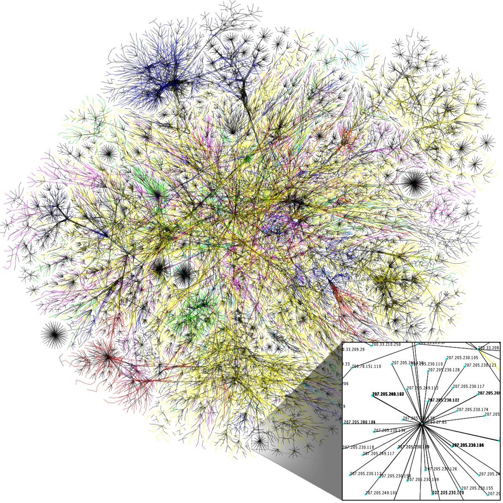
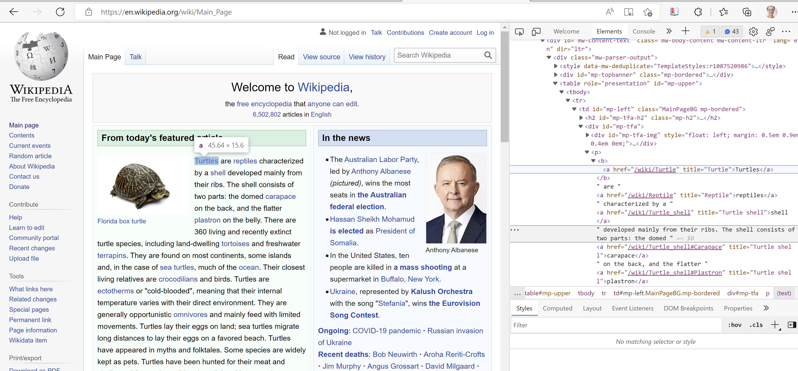
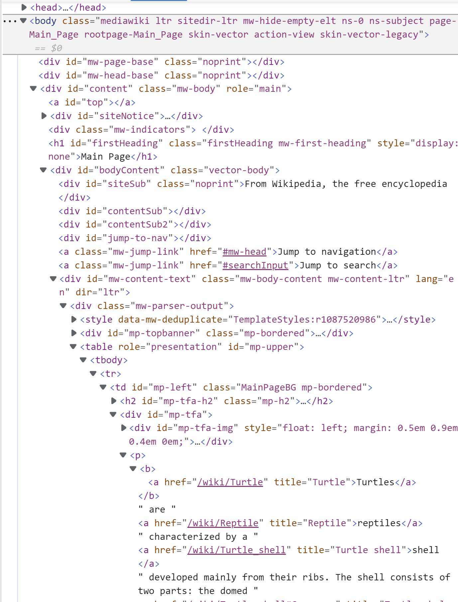

```{r setup, include=FALSE}
knitr::opts_chunk$set(echo = TRUE)
library(tidyverse)
```

# Plan for today

## What we will learn today:

- Why use the internet for data gathering?
- HTML - what is it and how does it work?
- Other internet languages
- Using `rvest` to extract text, tables and links
- Considerations when webscraping


# Languages of the web

Ah, the internet. A giant web of information, spanning space in unprecedented ways, tied together in an intricate formation by hyperlinks. The idea behind the World Wide Web was to link together pieces of information, and allow a person to access that web from any piece. Those pieces, they are HTML documents. The picture gives a visualization of a portion of the network that is the World Wide Web.

```{r, out.width="50%", fig.align="center", echo = FALSE}

```

The internet is a great source of information. It's unfortunately also not the most accessible data always, and the more data you have, the more difficult it can be to extract knowledge. Relying on webpages as a source of information can produce many manual processes where we sit and read webpage upon webpage, copy-paste tables or simply leave the information unused because manually processing it would take way too long. This is one reason why we have webscraping. Webscraping is basically the going into a webpage, copying the content you need and pasting it into a document at your own computer -- except we let the computer do this labor instead of humans. 

So what is a webpage? A webpage is a collection of information written in HTML that typically links to other webpages. Take Wikipedia for example. https://en.wikipedia.org . Wikipedia is a webpage -- an HTML document with lots of links to other HTML-documents. Most webpages are written in HTML, which stands for Hyper Text Markup Language. Information that is accessible in HTML is semi-structured. Most webpages also have some CSS (to make them beautiful) and Javascript (to make them exciting). We will come briefly back to these two other languages below. 

A webpage is always hosted on a server. This means somebody has the job of being the *host* of a server and maintain the daily functionality. You can think of servers as big computers, and in fact, you can choose to host webpages on your own server if you buy one. You can even choose to use your own computer as a server. Yet, most often when making and publishing webpages, people choose to rent space on other people's (and companies') servers. You can for example host your webpage in the cloud, using service providers such as Google, Amazon, or even RStudio. 

Between the server and the webpage, you have the browser. This could be for example Firefox, Opera, Google Chrome or Internet Explorer. The browser interprets the information on the webpage so that it becomes human-readable. 

```{r, out.width="100%", echo = FALSE}
knitr::include_graphics("../../figures/webpage_structure.png")
```

Webpage developers often talk about "frontend" and "backend" in a webpage.

 - **Frontend**: The part of the webpage you interact with. Frontend languages include HTML, CSS and Javascript.
 - **Backend**: The things working in the background to make apps and webpages work with for example databases and scripts. Backend languages include for example R, SQL, Python, Java or C++. 

We're going to focus on the frontend-part today, since this is where we find the webpage information that we typically want to scrape.

## Find the HTML code

The HTML of any webpage is wide open for anyone to view. Want to see how a webpage has been made? Open any webpage, for example https://en.wikipedia.org/. Right click on the page and choose "Inspect". On the right hand side you will see a pane with all the code that is used to build this particular webpage. If you hover over a part of it, you'll see which part of the webpage this particular HTML-code relates to. In the example below, I opened Wikipedia on a random day and it had an article about turtles. 

```{r, out.width="100%", echo = FALSE}

```

## HTML

HTML-code is hierarchical. It always starts with the element `<html>`. In here, you can for example specify what the language will be -- English, Norwegian, Spanish, Chinese, etc. Next comes two parts; `<head>` and `<body>`. They contain the following:

 - `<head>` : Metadata about the file, for example title of the document (that is shown in the tab pane in your browser), a description of the document, imported resources for the document, and so on.
 - `<body>` : All the content that we can see on the webpage, for example text, pictures, figures, tables, etc.

These parts are called "nodes". The start and ending of all nodes is visible in the document with a slash, for example `</head>` and `</html>`. 

```{r, out.width="100%", echo = FALSE}
knitr::include_graphics("../../figures/wikipedia2.png")
```

`<head>` and `<body>` are "children" of `<html>`. `<body>` is also a parent of several children, most often `<div>`. `<div>` specifies a division of the document. Hover over the different `<div>`s to see which divisions of the document they refer to.

```{r, out.width="50%", echo = FALSE}

```

It is not vital to know what all the nodes mean to do webscraping, but it can be useful. Here is a small overview of some of them:

 - `<div>` : Division of the document 
 - `<section>` : Section of the document
 - `<table>` : A table
 - `<p>` : A paragraph
 - `<h2>` : Headline of size 2
 - `<h6>` : Headline of size 6
 - `<a>` : Hyperlink, referencing to other webpages with `href`
 - `` : An image
 - `<br>` : Space between paragraphs.

## Write your own HTML

Let's have a small look at how HTML works in practice. We can write our own HTML code and make our web browser parse it -- i.e. make it human-readable.

1. Open notepad on your computer.
2. Write the following code:

```{html, eval = FALSE}
<html>
    <head>
        <title>mypage</title>
    </head>
    <body>
        <h2> Headline </h2>
        Here we have a webpage. It is not <a href = https://en.wikipedia.org/> Wikipedia </a>.
        <br>
        <br>
        But maybe it can be one day.
    </body>
</html>
```

3. Save the file on your computer. Name it something that ends with `.html`, for example **test.html**. 
4. Open the folder with your file and drag it into a tab in your browser. 

Try to right click and Inspect your own webpage. That's the HTML code you just wrote right there. 


## Other languages

Other web languages are usually not terribly important for webscraping, but because it's good to understand how things work, we will shortly introduce you to some of them. 

When a webpage uses CSS and Javascript (as most modern webpages do), we can see this in the HTML code as a reference to an external document. The `<head>` node is often a parent of these references -- references which nodes could be for example `<script>`, `<link>` or `<style>`. 

In the illustration below, the webpage uses the css-file "main.css" and the javascript-file "jquery.js". 

```{html, eval = FALSE}

<html>
  <head>
    <links href = "/styles/main.css">
  </head>
  <body>
    <h1>My page!</h1>
    <script src = "/js/jquery.js">
  </body>
</html>

```


### CSS

CSS stands for **Cascading Style Sheets** and is used to define the look on webpages beyond what HTML can do. It gives the developer more freedom to choose text sizes, fonts, colors, formats, and so on. CSS is the traditional language for beautifying webpages, but some developers use other languages, for example Sass.

The difference between a webpage with and without some design language can be quite significant. In the figure below, we see the same webpage with and without CSS.

```{r, out.width="80%", echo = FALSE}
knitr::include_graphics("../../figures/withandwithoutcss.png")
```


### Javascript

Javascript is used to make interactive webpages, for example the possibility of hovering over a graph to see the value of a coordinate. 

# Using `rvest`

There are many packages one can use to conduct webscraping in R. In this course, we will be focusing on the webpage `rvest`. It is a part of the `tidyverse` and is widely used and supported. 

Some of the most important functions in the `rvest` package are:

```{r eval = FALSE}
read_html(url) # Scrape HTML-content from the webpage

html_elements() # Identify elements in the HTML-code.

html_nodes() # Identify HTML-nodes (hmtl_node() identifies only one node).

html_nodes(".class") # Call a node based on CSS-class.

html_nodes("#id") # Call a node based on <div> id.

html_nodes(xpath="xpath") # Call a node based on xpath.

html_attrs() # Identify attributes, e.g. links.

html_table() # Make HTML-tables into dataframes.

html_text() # Strip HTML-nodes and extract only the text (html_text2() is, in some regards, an improvement upon this).
```

Which function you use depends partly on the structure of the webpage, and partly on which part of the webpage you want to extract. Below are some examples on how to extract text, tables and links. We'll use a Wikipedia article on oranges for the sake of illustration. The general method is:

1. Use `read_html` and place as an argument the name of the webpage that you want to extract.
2. Inspect the webpage and find the node to the section you want to extract information from.
3. Right-click on the HTML-structure and choose "copy selector".
4. Specify the node in `html_node` by pasting in what you copied in the previous step.
5. Choose function depending on what you want to extract, for example `html_text` if you want the text.

In addition, you should **make it a habit of downloading the webpage** to your own computer. This will help in many respects:

1. It makes your work easier on the server since you can download the page once, and then use this.
2. It makes your code reproducible, since even if the webpage changes, your local copy does not.
3. It allows you to work with these files without internet.

## Download the webpage

To download a webpage, use the function `download.file`, and add as the first argument the link to the page you want to download, and then, the path to the folder of the computer where you want to place it, ending with the name of the file and `.html`.

```{r}

download.file("https://en.wikipedia.org/wiki/Orange_(fruit)", # Download one html-file after another into the folder specified in folder
                destfile = "C:/Users/solvebjo/OneDrive - Universitetet i Oslo/Teaching/ISSSV1337/ISSSV1337/Week 2/links/Oranges.html")

```

## Extract text

Say we want the introduction on the Wikipedia-site about oranges (the fruit). If we use `read_html`, we call on the server to get to the webpage we use. It will give us the complete HTML-code, with `<html>`, `<head>`, `<body>` and everything. But first, of course, we need to load the package `rvest` into R. 

```{r, warning=FALSE, error=FALSE, message=FALSE}

library(rvest)

read_html("https://en.wikipedia.org/wiki/Orange_(fruit)") # Read directly from webpage

read_html("C:/Users/solvebjo/OneDrive - Universitetet i Oslo/Teaching/ISSSV1337/ISSSV1337/Week 2/links/Oranges.html") # Read from your downloaded file


```

So, say that the part of the information about oranges that is indicated in a red box in the picture.

```{r, out.width="100%", echo = FALSE}
knitr::include_graphics("../../figures/oranges1.png")
```

To extract this part, we need to find the node. Direct your mouse to the paragraph, right-click on it and choose "Inspect". Here we go, the node containing this paragraph is a `<p>` node. To get the complete path of this node:

1. Right-click on the node.
2. Choose "Copy".
3. Choose "Copy selector".

```{r, out.width="100%", echo = FALSE}
knitr::include_graphics("../../figures/oranges2.png")
```

Now, add to the code above `html_node` and paste in the thing you copied above. This gives us lots of children of our node. 

```{r}

read_html("C:/Users/solvebjo/OneDrive - Universitetet i Oslo/Teaching/ISSSV1337/ISSSV1337/Week 2/links/Oranges.html") %>%
  html_node("#mw-content-text > div.mw-parser-output > p:nth-child(9)")

```

To extract the text, add `html_text` to the pipeline. 

```{r}

read_html("C:/Users/solvebjo/OneDrive - Universitetet i Oslo/Teaching/ISSSV1337/ISSSV1337/Week 2/links/Oranges.html") %>%
  html_node("#mw-content-text > div.mw-parser-output > p:nth-child(9)") %>%
  html_text()

```

If you find your `html_text` picking up a lot of special characters and/or whitespace, try with `html_text2` instead. It's a new thing the `rvest` package makers introduced not so long ago. 

```{r}

read_html("C:/Users/solvebjo/OneDrive - Universitetet i Oslo/Teaching/ISSSV1337/ISSSV1337/Week 2/links/Oranges.html") %>%
  html_node("#mw-content-text > div.mw-parser-output > p:nth-child(9)") %>%
  html_text2()

```


## Extract tables

Extracting text tends to be fairly easy. Tables can be a bit trickier, but many of them are quite straight forward as well. Often, tables are shown in the HTML-code with the tags `<table>` and `<tbody>`. If we scroll down on the Wikipedia-page about oranges, we find a table containing information on the nutrition of oranges.

```{r, out.width="100%", echo = FALSE}
knitr::include_graphics("../../figures/oranges3.png")
```

To scrape this table, do the same as you did before. 

1. Add the webpage URL to the `read_html`.
2. Right-click and choose inspect on the part of the webpage you want to scrape.
3. Hover over the HTML-code to find which part refers to the area you want to scrape.
4. Right-click on this part and choose Copy, then Copy selector. 
5. Paste this into the `html_node` part.

Last, instead of adding `html_text`, we now use `html_table`. This parses the code into an R dataframe.

```{r}

read_html("C:/Users/solvebjo/OneDrive - Universitetet i Oslo/Teaching/ISSSV1337/ISSSV1337/Week 2/links/Oranges.html") %>%
  html_node("#mw-content-text > div.mw-parser-output > table.infobox.nowrap") %>%
  html_table()

```

Usually, you have to do a bit of extra work with the table after having extracted it, for example because there are empty cells, as in this case. This often requires a bit of data manipulation and string manipulation. We will be working more with strings and text in week 3. 

```{r}

read_html("C:/Users/solvebjo/OneDrive - Universitetet i Oslo/Teaching/ISSSV1337/ISSSV1337/Week 2/links/Oranges.html") %>%
  html_node("#mw-content-text > div.mw-parser-output > table.infobox.nowrap") %>%
  html_table() %>%
  na_if("") %>% # Replaces "" with NA
  na.omit() # Removes all NA

```

## Extract links

Out of tables and text, another thing that is common to want from a webpage is links. This is particularly so because you can use the links to **crawl**. When you do web crawling, you start on one webpage, then find the links you deem important, extract them, and use those links in another `read_html` to enter a new webpage and scrape content.

To scrape links, recall that the node `<a>` refers to hyperlinks, and `<href>` refers to other webpages. Let's go back to the initial text on the webpage. This chunk of text contained a lot of hyperlinks. If we want to extract them, add `html_elements` with the argument `"a"` to get the hyperlink references. To extract the link from these nodes, use `html_attr` with the argument `"href"`. 

```{r eval = FALSE}

read_html("C:/Users/solvebjo/OneDrive - Universitetet i Oslo/Teaching/ISSSV1337/ISSSV1337/Week 2/links/Oranges.html") %>%
  html_node("#mw-content-text > div.mw-parser-output > p:nth-child(9)") %>%
  html_elements("a") %>%
  html_attr("href")

```

What we get here is the links to other webpages and links to references (notes) at the bottom of the Wikipedia page. Again, say we wanted only the links that refer to external webpages (not references) -- how would we go about extracting only those? Once again, we need to use data and string manipulation. 

```{r}

links <- read_html("C:/Users/solvebjo/OneDrive - Universitetet i Oslo/Teaching/ISSSV1337/ISSSV1337/Week 2/links/Oranges.html") %>%
  html_node("#mw-content-text > div.mw-parser-output > p:nth-child(9)") %>%
  html_elements("a") %>%
  html_attr("href") %>%
  str_extract("/wiki.*") %>% # Gathers only the strings that start with "/wiki", then followed by anything (.*)
  na.omit() %>% # All other string become NA, we remove these
  str_c("https://en.wikipedia.org/", .) # str_c pastes together two strings, we do this in order to get the full webpage

```

We could use these links in a loop. Under, I show an example with a for-loop where I extract the text from each page and add it to a list-element.

```{r}

linkstopic <- str_remove(links, "https://en.wikipedia.org//wiki/")

for(i in 1:length(links)) { # For all the links...
  
  download.file(links[[i]], # Download one html-file after another into the folder specified in folder
                destfile = str_c("C:/Users/solvebjo/OneDrive - Universitetet i Oslo/Teaching/ISSSV1337/ISSSV1337/Week 2/links/", linkstopic[i], ".html"))
}

```

```{r}

info <- list() # Make a list-object where you can put the output from the loop

for (i in 1:length(links)) { # For each i in every element from place number one to the last place in links (given by length(links))
  
  page <- read_html(links[[i]]) # Read the html-page for each i
  
  page <- page %>% # Use this page
    html_elements("p") %>% # And fetch the paragraph elements
    html_text() # Then extract the text from these elements
  
  info[[i]] <- page # Place the text for each link into its respective place in the info-object
  
}

# An example of what the info-object contains:

info[[1]][3]
info[[2]][3]
info[[3]][2]

```


# Considerations when webscraping

If you gather a lot of information from a webpage quickly and rapidly, it can add a large pressure to the server. Worst case, the server might crash, and then all the webpages go down. To avoid this, make sure to:

 - Save the data locally so you do not have to scrape multiple times.
 - Set a timer on a few seconds between each time your code makes a new query to the server.
 - Scrape only what you actually need.
 - Check the robots.txt file to see which information the webpage provider thinks it's okay and not okay to scrape. You check this through webpage/robots.txt, for example wikipedia/robots.txt.

Because webscraping can be pretty hard on your service provider, and because it can take some time to write webscraping scripts, it is useful to check whether the webpage you are scraping from provides an API for the data you're interested in. If that is so, you are in for an easier task. More about APIs tomorrow. 
