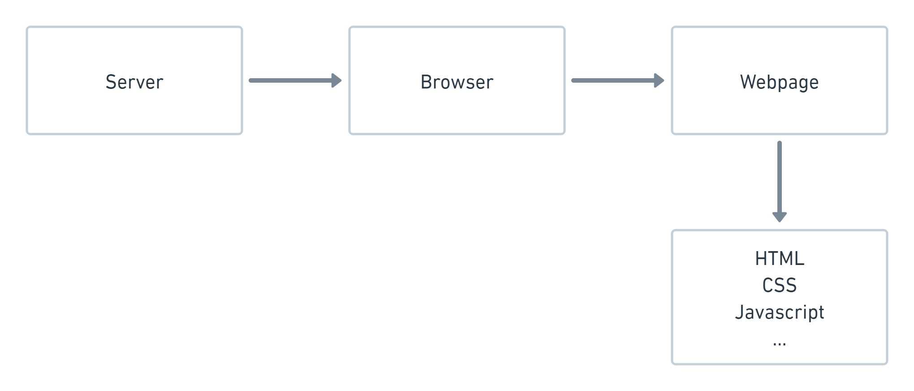
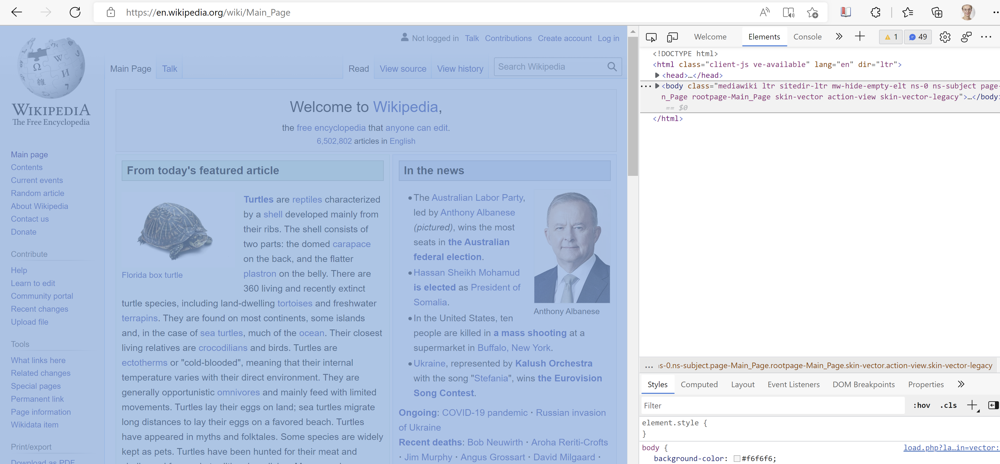
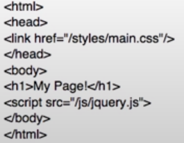

```{r setup, include=FALSE}
knitr::opts_chunk$set(echo = TRUE)
```

# Plan for today

## What we will learn today:

- Languages of the web
- Using `rvest`

## What we will do today:

- Practical tasks
- Search for webpages relevant to problem statement


# Languages of the web

Ah, the internet. A giant web of information, spanning space in unprecedented ways, tied together in an intricate formation by hyperlinks. The idea behind the World Wide Web was to link together pieces of information, and allow a person to access that web from any piece. Those pieces, they are HTML documents. The picture gives a visualization of a portion of the network that is the World Wide Web.

```{r, out.width="50%", echo = FALSE}
knitr::include_graphics("./figures/internet.png")
```

The internet is a great source of information. It's unfortunately also one of those examples where lots and lots of data makes it difficult to extract knowledge. Also, it can promote many manual processes where we sit and read webpage upon webpage, copy-paste tables or simply leave the information unused because manually processing it would take way too long. This is one reason why we have webscraping.

So what is a webpage? Take Wikipedia. https://en.wikipedia.org . Wikipedia is a webpage -- an HTML document with lots of links to other HTML-documents. Most webpages are written in HTML, which stands for Hyper Text Markup Language. However, most of them also have so CSS (to make them beautiful) and Javascript (to make them exciting). We will come back to this. 

A webpage is always hosted on a server. This means somebody has the job of being the *host* of a server and maintain the daily functionality. You can choose to host your own server, you can even choose to use your own computer as a server. Yet, most often when making and publishing webpages, people choose to rent space on other people's (and companies') servers. You can for example host your webpage in the cloud, using service providers such as Google, Amazon, or even RStudio. 

Between the server and the webpage, you have the browser. This could be for example Firefox, Opera, Google Chrome or Internet Explorer. The browser interprets the information on the webpage so that it becomes human-readable. 

```{r, out.width="50%", echo = FALSE}

```

Webpage developers often talk about "frontend" and "backend" in a webpage.

 - **Frontend**: The part of the webpage you interact with. Frontend languages include HTML, CSS and Javascript.
 - **Backend**: The things working in the background to make apps and webpages work with for example databases and scripts. Backend languages include for example R, SQL, Python, Java or C++. 

We're going to focus on the frontend-part today, since this is where we find the webpage information that we typically want to scrape.

## Find the HTML code

The HTML of any webpage is wide open for anyone to view. Want to see how a webpage has been made? Open any webpage, for example https://en.wikipedia.org/. Right click on the page and choose "Inspect". On the right hand side you will see a pane with all the code that is used to build this particular webpage. If you hover over a part of it, you'll see which part of the webpage this particular HTML-code relates to. 

```{r, out.width="50%", echo = FALSE}
knitr::include_graphics("./figures/wikipedia.png")
```

## HTML

HTML-code is hierarchical. It always starts with the element `<html>`. In here, you can for example specify what the language will be. Next comes two parts; `<head>` and `<body>`. They contain the following:

 - `<head>` : Metadata about the file, for example title of the document (that is shown in the tab pane in your browser), a description of the document, imported resources for the document, and so on.
 - `<body>` : All the content that we can see on the webpage, for example text, pictures, figures, tables, etc.

These parts are called "nodes". The start and ending of all nodes is visible in the document, for example `</head>` and `</html>`. 

```{r, out.width="50%", echo = FALSE}

```

`<head>` and `<body>` are "children" of `<html>`. `<body>` is also a parent of several children, most often `<div>`. `<div>` specifies a division of the document. Hover over the different `<div>`s to see which divisions of the document they refer to.

```{r, out.width="50%", echo = FALSE}
knitr::include_graphics("./figures/wikipedia3.png")
```

It is not vital to know what all the nodes for webscraping, but here is a small overview of some of them:

 - `<div>` : Division of the document 
 - `<section>` : Section of the document
 - `<table>` : A table
 - `<p>` : A paragraph
 - `<h2>` : Headline of size 2
 - `<h6>` : Headline of size 6
 - `<a>` : Hyperlink, referencing to other webpages with `href`
 - `` : An image
 - `<br>` : Space between paragraphs.

## Write your own HTML

Let's have a small look at how HTML works in practice. We can write our own HTML code and make our web browser parse it -- i.e. make it human-readable.

1. Open notepad on your computer.
2. Write the following code:

```{r, eval = FALSE}
<html>
    <head>
        <title>mypage</title>
    </head>
    <body>
        <h2> Headline </h2>
        Here we have a webpage. It is not <a href = https://en.wikipedia.org/> Wikipedia </a>.
        <br>
        <br>
        But maybe it can be one day.
    </body>
</html>
```

3. Save the file on your computer. Name it something that ends with `.html`, for example **test.html**. 
4. Open the folder with your file and drag it into a tab in your browser. 

Try to right click and Inspect your own webpage. That's the HTML code you just wrote right there. 


## Other languages

Other web languages are usually not terribly important for webscraping, but because it's good to know to understand how things work, we will shortly introduce you to some of them never the less. 

When a webpage uses CSS and Javascript (as most modern webpages do to some extent), we can see this in the HTML code as a reference to an external document. The `<head>` node is often a parent of these references -- references which nodes could be for example `<script>`, `<link>` or `<style>`. 

In the image below, the webpage uses the css-file "main.css" and the javascript-file "jquery.js". 

```{r, out.width="80%", echo = FALSE}

```


### CSS

CSS stands for **Cascading Style Sheets** and is used to define the look on webpages beyond what HTML can do. It gives the developer more freedom to choose text sizes, fonts, colors, formats, and so on. CSS is the traditional languages, but some developers use other languages with a purpose of defining webpage looks, for example Sass.

The difference can be quite significant. In the figure below, we see the same webpage with and without CSS.

```{r, out.width="80%", echo = FALSE}
knitr::include_graphics("./figures/withandwithoutcss.png")
```


### Javascript

Javascript is used to make interactive webpages, for example the possibility of hovering over a graph to see the value of a coordinate. In the image below, javascript is responsible for the neat graphic of the web in the background.

```{r, out.width="80%", echo = FALSE}
#
```

# Using `rvest`

There are many packages one can use to conduct webscraping in R. In this course, we will be focusing on the webpage `rvest`. It is a part of the `tidyverse` and is widely used and supported. 

Some of the most important functions in the `rvest` package is:

```{rm eval = FALSE}
read_html(url) # Scrape HTML-content from the webpage

html_elements() # Identify elements in the HTML-code.

html_nodes() # Identify HTML-nodes (hmtl_node() identifies only one node).

html_nodes(".class") # Call a node based on CSS-class.

html_nodes("#id") # Call a node based on <div> id.

html_nodes(xpath="xpath") # Call a node based on xpath.

html_attrs() # Identify attributes, e.g. links.

html_table() # Make HTML-tables into dataframes.

html_text() # Strip HTML-nodes and extract only the text (html_text2() is, in some regards, an improvement upon this).
```

## Extract text


## Extract tables


## Extract links


# Considerations when webscraping

If you gather a lot of information from a webpage quickly and rapidly, it can add a large pressure to the server. Worst case, the server might crash, and then all the webpages go down. To avoid this, make sure to:

 - Save the data locally so you do not have to scrape multiple times.
 - Set a timer on a few seconds between each time your code makes a new query to the server.
 - Scrape only what you actually need.
 - Check the robots.txt file to see which information the webpage provider thinks it's okay and not okay to scrape. You check this through webpage/robots.txt, for example wikipedia/robots.txt.


