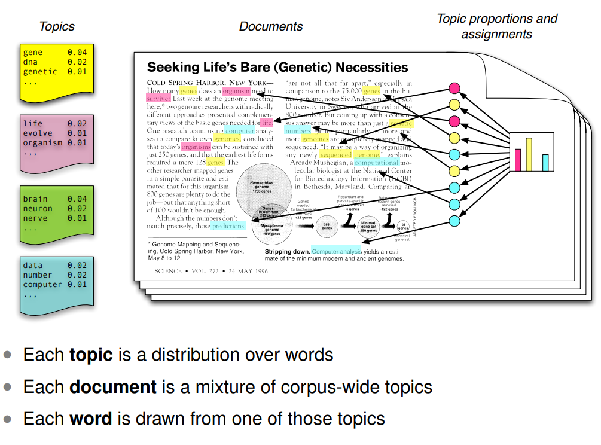

```{r setup, include=FALSE}
knitr::opts_chunk$set(echo = TRUE, warning = FALSE, message = FALSE, error = FALSE)
library(tidyverse)
```


# Plan for today

## What we will learn today:

- What text modelling means
- What is topic modelling?
- How to implement topic models in R
 - Choosing topic model
 - How to label topics
 - Choosing number of topics
 - Classify topics


# Text modelling

So far we have looked into how to do text manipulation, preprocessing, tokenization and vectorization. These methods offer a good start of departure to analyze the text, because then we can find descriptive statistics (e.g. which words occur most often) and visualize the findings. As noted in the book [Tidytext](https://www.tidytextmining.com/topicmodeling.html), the final process of working with text might look something like that below^[We have not worked with sentiment analysis, and as such, the "Sentiment Lexicon isn't that relevant for us now. Recall also that a "Corpus" is a collection of documents/texts, and a document-term matrix is basically the same as a document-feature matrix.]. Today, we are going to take a closer look at the "Model" part. 

```{r,  out.width="100%", echo = FALSE, fig.show="hold"}
knitr::include_graphics("../../figures/textprocess.png")
```

There are many ways to model text, among them being: 

 - Sentiment analysis
 - Text classification
 - Text scaling
 - Topic modelling

We'll be looking at topic modelling in this lecture. If you want to learn more about quantiative text analysis, there's a [course at UiO](https://www.uio.no/studier/emner/sv/statsvitenskap/STV2022/index.html) that goes in-depth on this.


## What is topic modelling?

Topic modelling is all about classifying text into groups, here known as *topics*. The machine skims over the words in each document and uses these words to find out which topics the document represent, and which words that fit together to represent these topics. While the machine aids us with the actual grouping, we have to interpret what each topic means ourselves. In other words; topic models group the text into topics, but we have to manually give names and labels to the topics afterwards.

```{r,  out.width="80%", echo = FALSE, fig.show="hold"}
knitr::include_graphics("../../figures/topic_process.png")
```


Topic modelling is actually a form of *unsupervised learning*. This is a machine learning technique that we will learn more about later in the class.


# Implementing topic models in `R`

Before (or during) our topic modelling, there are a few things we need to consider:

 - What type of topic model do we need?
 - How should we label the topics?
 - How many topics are appropriate?


## What type of topic model do we need?

There are many ways of estimating a topic model. The most common method is called **LDA**, which stands for Latent Dirichlet Allocation. LDA assumes that each document is made up of a distribution of topics and that each topic is in turn made up of a distribution of words. LDA then tries to construct the "hidden layer" that connects the words and the documents -- the topics. The algorithm underlying the model is pretty complex, but we will focus on the intuitive understanding and implementation here. If you are curious to learn more, [this article](http://www.cs.columbia.edu/~blei/papers/Blei2012.pdf) talks more about how topic models work^[The article is a pretty old (from 2012), but one of the most pedagogical on the field.].

```{r,  out.width="100%", echo = FALSE, fig.show="hold"}
knitr::include_graphics("../../figures/topic_model_process.png")
```

Other types of models include Structural Topic Models (STM), Gibbs Sampling Dirichlet Multinomial Mixture (GSDMM) and Time Series Topic Model (TSTM). STM allows for correlation between topics, GSDMM is good for very small texts, e.g. from Twitter, and TSTM is made for time series data. Since **LDA** is by far the most used model, we'll learn this one today. 

Three packages become relevant as we work with LDA topic models -- `tidytext`, `quanteda` and `stm`. We load them all into `R`. 

```{r}

library(tidytext)
library(quanteda)
library(stm)

```

Next, we read in the tokenized dataframe that we worked with yesterday using the function `readRDS`. The topic model requires a *bag of words* in a document feature matrix, so this is what we'll use. As you might recall, to get a dfm, we use the function `cast_dfm` with the name of the document, the name of the token and the name of the count variable as the arguments.

```{r}

westside_tokens <- readRDS("../../datafolder/westside_tokens.rds") # Read in dataset from yesterday

westside_dfm <- westside_tokens %>%
  cast_dfm(songname, stem, count) # Make a document feature matrix

```

Once we have a dfm, we can use the function `stm` to run a topic model. `stm` stands for structural topic model, so it will by default to a STM. To run an LDA instead, specify `"LDA"` as an argument under `init.type`. The other very important argument in this function is `K`, which says how many topics to estimate. In this case, I set `K` to 6, but we'll look more into how to determine `K` later.

The other arguments -- seed and verbose -- are less important. Set the seed to get the same results whenever you run the topic model, and set verbose to FALSE if you do not want lots of information on the screen while the function estimates the topic model.

If you have many documents with lots of text, this piece of code can take quite some time to finish.

```{r}

westside_lda <- stm(westside_dfm, # Use a document feature matrix as input
                    init.type = "LDA", # Specify LDA as the type of model
                    K = 6, # Specify the number of topics to estimate
                    seed = 910, # Make the model reproducible
                    verbose = FALSE) # Set to FALSE to avoid lots of text while running the model


```


## How should we label the topics?

The topic model uses both the documents and the words to calculate topics. We can access this model to figure out which words that contribute most to different topics. Using `tidy` on the model we just ran with the argument `matrix = "beta"` tells us, for each topic, how likely it is that a certain word will represent this topic. This probability is the `beta` measure.

```{r}

westside_topics <- tidy(westside_lda, 
                        matrix = "beta") # Get the probability of each word being generated within each topic

```

To get a better view of the most important words for each topic, we can use `slice_max` and `group_by` to fetch the 10 terms that have the highest probability of falling within each respective topic.

```{r}

westside_topics_group <- westside_topics %>%
  group_by(topic) %>% # Getting the top term per topic, thus using group_by
  slice_max(beta, n = 10) %>% # Fetching the 10 terms with the highest beta
  ungroup() # Ungrouping to get the dataframe back to normal

westside_topics_group

```

An even nicer way of showing our results, is to visualize it. Using `ggplot`, we can make a few graphs that display the word probabilities for each topic.

```{r}

westside_topics_group %>%
  ggplot(aes(term, beta, fill = topic)) + # Plotting the terms, the beta values (probabilities) and coloring them after topic
  geom_bar(stat = "identity") + # Creating a bar chart and making the y-axis the same as beta
  facet_wrap( ~ topic, # # Make different plots for each topic
              ncol = 3, # Arrange them in three columns
              scales = "free") + # Make the y-axes so that they can range freely, i.e. do not depend on each other
  labs(x = "", y = "Word-Topic probability") + # Adding names to the x-axis and y-axis
  theme_bw() + # Making the color background white
  theme(legend.position = "none", # Removing the legend
        axis.text.x = element_text(angle = 90, vjust = 0.5, hjust = 1)) # Making the text on the x-axis appear vertically

```

Recall that we had to give names and labels to the topics ourselves. Here, the topics are merely called topic 1, topic 2, topic 3, etc. Using the word probabilities, we get an impression of what these topics might be about. For example, in attempting a small interpretation:

 - Topic 1: Noise topic (no inherent meaning)
 - Topic 2: Happiness and joy
 - Topic 3: Social problems
 - Topic 4: Grave issues
 - Topic 5: Night-time
 - Topic 6: Immigration
 
Might these topics reflect what West Side Story is about?

Often, the topic model produces one or more topics that contain just noise. I speculate that topic 1 might be a noise-topic in our model. Noise topics are like a web -- they catch the unimportant words so that other topics might get the meaningful ones. Therefore, we should be happy that they exist, even though we do not intend to use them to create meaningful insight about the text collection. 

For more information and nice code, check out [this website](https://juliasilge.com/blog/sherlock-holmes-stm/).


## How many topics are appropriate? 

One last consideration is necessary to deal with; how many topics are appropriate for this collection of texts? In other words; how many topics does West Side Story actually deal with through their songs? LDA does not know how many topics to estimate, it will estimate as many topics as you ask it to estimate through the `K =` argument. Thus, we need to do some work to figure out the "optimal" number of topics.

We'll do this by estimating many topic models with various `K`, and then check model diagnostics to figure out which number of topics give the best measures. In the code below, I use the `furrr` package to do some parallel processing (i.e. letting the machine run several models at the same time) and save time. Then, I use `future_map` to run the code several times at the same time, and vary only `K`.

Since we only have 14 documents, and the songs are rather short, I estimate models with only 3, 5, 6, 7, 8, 10 and 13 topics respectively. However, if you have larger collections of text, I suggest estimating a lot more. 

```{r, message=FALSE, warning=FALSE}

library(furrr)
plan(multisession) # Plan for parallel processing using several sessions

K <- c(3, 5, 6, 7, 8, 10, 13) # Choose the number of topics for each model

many_models <- tibble(K = K) %>% # Making a tibble with the number of topics as variable
  mutate(topic_model = future_map(K, ~ stm(westside_dfm, # Estimate the topic model using stm and the dfm we made earlier
                                           K = ., # Vary only K -- the dot refers back to the K in the tibble we made
                                           verbose = FALSE), # Stay quiet regarding output
                                  .options = furrr_options(seed = TRUE))) # An option to suppress a warning message

```

The object `many_models` contains, indeed, many topic models with different K. We use these models to calculate model diagnostics and choose the model that scores overall best on all diagnostic tests. The diagnostics we will estimate is:

 - **Exclusivity**: The degree to which each word occurs in one single topic (as high as possible)
 - **Semantic coherence**: The degree to which probable words in a topic occur together (as high as possible)
 - **Residual**: The degree to which variance is not accounted for in the topic model (as low as possible)
 - **Heldout**: The degree to which the topic model is able to predict topics on text that was not used to estimate the model (as high as possible)
 
Exclusivity and semantic coherence are the two most important ones when figuring out how many topics to choose. 

We estimate these diagnostics by making a dataframe with all diagnostics given the different topic models and represent them in a graph. The code below is borrowed shamelessly from the [blog post](https://juliasilge.com/blog/evaluating-stm/) by Julia Silge (the author of the `tidytext` package). Have a look at it if you want to test out some more cool code. 

Studying the plots, it appears that we might be able to get a rather optimal trade-off between the different measures by landing the number of topics on around 6.

```{r}

heldout <- make.heldout(westside_dfm) # Making the heldout measure

k_result <- many_models %>% # Using mutate to make new variables
  mutate(exclusivity = map(topic_model, exclusivity),  # Using map to iterate over all topic models in the many_models object and fetch the exclusivity measure
         semantic_coherence = map(topic_model, semanticCoherence, westside_dfm), # Fetching semantic coherence measure
         eval_heldout = map(topic_model, eval.heldout, heldout$missing), # Feting the heldout measure
         residual = map(topic_model, checkResiduals, westside_dfm), # Fething the residuals measure
         iterations = map_dbl(topic_model, function(x) length(x$convergence$bound))) # Fetching the number of iterations for each model

k_result %>%
  transmute(K, # Make a new dataframe out of the old one starting with K (number of topics)
            Residuals = map_dbl(residual, "dispersion"), # Adding residual measure
            `Exclusivity` = map_dbl(exclusivity, mean), # Adding exclusivity measure
            `Semantic coherence` = map_dbl(semantic_coherence, mean), # Adding semantic coherence measure
            `Held-out likelihood` = map_dbl(eval_heldout, "expected.heldout")) %>% # Adding held-out likelihood measure
  gather(Metric, Value, -K) %>% # Make it into a long dataframe
  ggplot(aes(K, Value, color = Metric)) + # Plot number of topic agains the different metrics (diagnostics)
  geom_line(size = 1.5, alpha = 0.7, show.legend = FALSE) + # Make a line graph
  facet_wrap(~Metric, scales = "free_y") + # Make small different plots for each metric
  labs(x = "K (number of topics)", 
       y = NULL,
       title = "Model diagnostics by number of topics",
       subtitle = "The optimal number of topics seems to be around 5") + 
  theme_bw()


```

Since semantic coherence and exclusivity are the most important diagnostics, we can plot these two in a separate graph. There is usually a trade-off between semantic coherence and exclusivity. The more exclusive each word is for each topic, the more difficult it is for words with high topic probability to occur together. High semantic coherence can for example be achieved by having a few topics dominated by very common words, while exclusivity increases when we have many documents with a few exceptional words in each topic. The ideal lies somewhere in between.

As you can see from the plot, topics that score high on semantic coherence doesn't always score equally high on exclusivity. This plot shows us that the number of topics might even be higher than 6, maybe even as high as 10.

```{r}

k_result %>%
  select(K, exclusivity, semantic_coherence) %>% # Getting the variables K, exclusivity and semantic coherence
  unnest() %>% # Unnesting these from a nested dataframe to a normal dataframe
  mutate(K = as.factor(K)) %>% # Making the K variable into a factor to make plotting easier
  ggplot(aes(semantic_coherence, exclusivity, color = K)) + # Plotting semanitc coherence on the x-axis and exclusivity on the y-axis, coloring the dots after topic
  geom_point(size = 2, alpha = 0.7) + # Making a scatterplot and setting size and transparency of the dots
  labs(x = "Semantic coherence", 
       y = "Exclusivity",
       title = "Comparing exclusivity and semantic coherence",
       subtitle = "Models with fewer topics have higher semantic coherence for more topics, but lower exclusivity") + 
  theme_bw()

```

Let's go with `K = 10` this time and see how the topic look now. To do this, we can fetch the model with 10 topics directly from the `many_models` object we made earlier.

```{r}

westside_lda <- many_models %>%
  filter(K == 10) %>% # Filtering out the topic model with 10 topics
  pull() %>% # Extracting the model from the object
  .[[1]] # Getting it from the list

```

Then we calculate the word probabilities again.

```{r}

ws_word_prob <- tidy(westside_lda, matrix = "beta") # Calculating word probabilities

```

And to illustrate, we can now also calculate the document probabilities. This is the probability that each document will fall into a certain topic. 

```{r}

ws_doc_prob <- tidy(westside_lda, matrix = "gamma", # Calculating document probabilities
                    document_names = rownames(westside_dfm)) # Adding the names of the songs to the dataframe

ws_doc_prob

```

To recap: Recall that topic models using LDA as estimation method work like this:

 - Go over words in the text to see which topic they express.
 - Go over documents in the text to see which topic they land on given their word use.
 - Do this again and again until it doesn't seem like the model would be better if you rearrange another word or document^[This point is called model convergence].

```{r,  out.width="06%", echo = FALSE, fig.show="hold"}

```

So when we run a topic model, we get two important estimates; the *word probabilities* and the *document probabilities*.

 - To fetch the word probabilities from the model, use: `tidy(your_topic_model, matrix = "beta")`.
 - To fetch the document probabilities from the model, use: `tidy(your_topic_model, matrix = "gamma")`

As before, we can plot the top word probabilities per document to figure out which words that appear to belong to which topic. We can combine this with the document probabilities to see how much of the topic that is represented in the text. 

```{r}

library(scales)

top_terms <- ws_word_prob %>%
  group_by(topic) %>% # Get subsequent estimates per topic
  slice_max(beta, n = 5) %>% # Get the top five terms based on their beta score (highest word probabilities per topic)
  select(topic, term) %>% # Fetch the variables topic and term
  summarise(terms = list(term)) %>% # Make the term variable into a list within the dataframe
  mutate(terms = map(terms, paste, collapse = ", ")) %>% # Run over the list and paste the words together with a comma in between
  unnest(cols = c(terms)) # Remove the list and make it into a normal dataframe cell again

gamma_terms <- ws_doc_prob %>%
  group_by(topic) %>% # Get estimate per topic
  summarise(gamma = mean(gamma)) %>% # Find the average document probability per topic
  arrange(desc(gamma)) %>% # Arrange the topics in declining order based on their gamma score
  left_join(top_terms, by = "topic") %>% # Merge the dataframe with the terms
  mutate(topic = paste0("Topic ", topic), # Give the topic the name "Topic" followed by the number
         topic = reorder(topic, gamma)) # Order so that the topic with the highest gamma score comes at the top

gamma_terms %>%
  ggplot(aes(topic, gamma, # Plot topic against document probability 
             label = terms, # Put labels at the end of each bar with the top terms for each topic
             fill = topic)) + # Give them color after topic
  geom_bar(stat = "identity") + # Make a bar plot with the y-axis fixed
  geom_text(hjust = 0, nudge_y = 0.01, size = 3.5) + # Adjust the position and size of the text
  coord_flip() + # Flip the graph sideways
  labs(x = "", y = "Topic proportion") + # Give labels to the axes
  scale_y_continuous(expand = c(0,0),
                     limits = c(0, 0.5),
                     labels = percent_format()) + # Fix the scale on the y-axis to some percentage with 10 percent in between
  theme_minimal() + # A white theme for the plot
  theme(legend.position = "none") # Do not display legend

```

Could the labels be something like this?

| **Topic** | **5 top words**                                           | **Label**       |
|-----------|-----------------------------------------------------------|-----------------|
| 9         | hand, hold, day, life, heart                              | Struggle        |
| 5         | tonight, gonna, world, star, em                           | Hope            |
| 3         | boy, Krupke, sick, social, office, trouble                | Social problems |
| 1         | come, halfway, something, block, beach, catch, due, reach | Noise           |
| 6         | jet, begging, bugging, street, stay                       | Street          |
| 2         | Maria, sound, beauty, stop, play                          | Infatuation     |
| 7         | pretty, feel, girl, love, charm, mirror                   | Joy             |
| 10        | america, island, juan, san, puerto                        | Immigration     |
| 8         | love, boy, heart, Anita, wrong                            | Love            |
| 4         | time, day, live, hand, care                               | Noise           |


## Classify topics

A final thing one may want to do when operating with topic models, is to classify each document into a topic. The document probabilities (the `gamma`) after all gives us a probability that a document will belong to a certain topic, but it does not assign a topic to a document.

There is no all-agreed way to set a cutoff point to assign a topic to a document. Should a 50 percent change be enough for a text to classify as a certain topic? 20 percent? 80 percent? Every topic that scores higher than the average document probability? We might also want to consider whether we think it's likely that one text can be about many topics, or whether each document should only be assigned one topic. 

In the code below, I show how to assign for each document the topic that they have the highest probability of falling within. 

```{r}

top_docs <- ws_doc_prob %>%
  filter(!topic %in% c(1, 4)) %>% # I remove the topics I labelled "noise"
  group_by(document) %>% # Find the next statistic per document
  summarise(gamma = max(gamma)) # Find the max value

topic_assignment <- left_join(top_docs, ws_doc_prob, by = c("document", "gamma")) # Merge the dataframe with the top documents with the one containing topics

topic_assignment <- topic_assignment %>% # Rename the topics after the labels I gave them
  mutate(topic_label = case_when(topic == 9 ~ "Struggle",
                                 topic == 5 ~ "Hope",
                                 topic == 3 ~ "Social problems",
                                 topic == 1 ~ "Noise",
                                 topic == 6 ~ "Street",
                                 topic == 2 ~ "Infatuation",
                                 topic == 7 ~ "Joy",
                                 topic == 10 ~ "Immigration",
                                 topic == 8 ~ "Love", 
                                 topic == 4 ~ "Noise"))

```

```{r}

topic_assignment %>%
  select(document, topic_label) %>% # Fetch the document and the topic_label variables
  mutate(document = str_replace_all(document, "-", " "), # Replace the hyphen (-) in the songnames with a space
         document = str_to_title(document)) %>% # Make the words in the string upper case
  rename(Song = document, # Rename the document variable to "Song"
         Topic = topic_label) %>% # Rename the topic_label variable to "Topic"
  kableExtra::kable() # Make a beautiful table out of it

```
